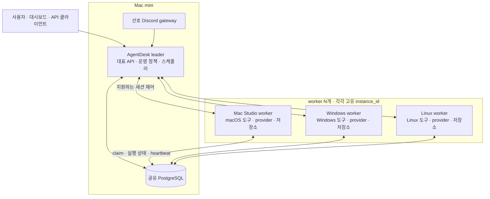

# 중앙 host와 다중 OS worker 클러스터 도입 검토

> Last refreshed: 2026-09-22 (against `main` @ `c61416327fd1a79b24cc7b215799997cfdb3dd3d`).
>
> 대상: [kunkunGames/AgentDesk](https://github.com/kunkunGames/AgentDesk/tree/c61416327fd1a79b24cc7b215799997cfdb3dd3d)
>
> 상태: 아래 §0의 구현·검증 기록을 기준으로 진행 중이다. §1 이후의 원래 소스 조사는 위 baseline commit을 기준으로 하며, 제안 전체의 구현·배포 완료를 의미하지 않는다.
>
> 운영 설정의 정본과 저장 위치는 [Source of Truth](../source-of-truth.md), 설정 도메인은 [Config Domains](../config-domains.md)를 따른다.

## 0. 구현 결정과 검증 기록

실제 적용 대상은 **Mac mini leader + Windows worker**로 확정했다. worker 수는 N개이며
macOS/Linux/Windows에 공통 등록·배정 계약을 적용한다. 별도 worker binary, 새로운 큐,
새로운 DB를 제품 구조에 추가하지 않는다. 역할별 기능 시작 계획과 플랫폼 adapter를
분리하고, 설정으로 노드를 추가하는 구조를 유지한다. 개발용 격리 PostgreSQL은 검증 fixture다.

| 범위 | 현재 구현/증거 | 완료 판정에 남은 검증 |
| --- | --- | --- |
| R1 공유 설정 소유권 | `src/db/postgres/shared_config.rs`로 동기화 책임 분리. worker/auto는 중앙 값 확인만 수행하며 초기화 전에는 오류 반환. audit/import도 동일 소유권 함수 사용 | 실제 PG 보존·reset·선부팅·경쟁 테스트 및 두 장비 재시작 |
| R4 공통 release | OS별 공통 패키징·manifest 검증·GitHub workflow 추가. 세 archive 형식과 변조/누락 방지 테스트 통과 | GitHub native matrix, 실제 Release 게시, 노드 설치/갱신 |
| R2·R3·R5·R6·R7·R8·R9 | 기존 구현 자산을 연결하는 순차 작업 범위로 유지 | 각 절의 완료 기준 및 혼합 OS E2E |
| 원격 접근 | Windows → Mac mini 공개키 SSH 및 원격 명령 실행 확인 | 배포·migration·leader/worker 전환은 별도 검증 |

패키징의 실행 방법과 게시 계약은 [공통 release 문서](../ci/release-packaging.md)를 따른다.
`--skip-dashboard`는 UI 제외로 일관되게 동작하며, 공개 Release는 dashboard를 포함한다.
운영자 비밀값·로컬 설정·worktree는 artifact에 넣지 않는다. 배포 파일을 줄이기 위해
제품 구조를 중복시키지 않고, 먼저 기존 role이 실제 실행 모듈을 제한하도록 구현한다.

**Mac mini 업그레이드 사전 확인:** 운영 DB에는 Kakao calendar migration이 120/121번으로
적용되어 있으나 현재 main에서는 같은 SQL이 122/123번으로 이동했다. 각 SQL의 SHA-384는
운영 DB에 기록된 checksum과 일치한다. 현재 120/121번은 relay redelivery/campaigns다.
따라서 일반 migration 실행 전에 정확한 과거 version/description/checksum을 확인하는
이관 경로와 격리 DB 검증이 필요하다. checksum 검사를 끄거나 기존 데이터를 지우는 방식은
사용하지 않는다. 운영 DB의 변경은 아직 수행하지 않았다.

## 1. 판단과 적용 범위

권장 구성은 **같은 AgentDesk 코드·릴리스의 OS별 실행 파일을 설치하고, Mac mini를 명시적 leader, Mac Studio·Windows·Linux 장비를 각각 worker로 연결하는 단일 클러스터**다. agent의 논리적 정의와 운영 정책은 중앙에서 관리하고, 각 worker에는 필요한 provider·인증·도구·로컬 저장소를 준비한다. 두 Mac은 첫 도입 대상이며, 설계의 worker 수를 두 대 구성에 고정하지 않는다.

기존 코드로 텍스트 기반 원격 실행을 구성할 수 있으므로 클러스터 엔진이나 별도 경량 worker 프로그램을 새로 만드는 것은 첫 단계의 필수 구현이 아니다. 다만 **worker 배포 시 중앙 설정 보호**, **토큰을 사용하는 원격 대시보드 인증 연결**, **실제 실행 능력에 맞는 배정**, **노드 증가에 따른 DB 연결 예산**에는 보완·검증할 지점이 있다.

현재 코드와 신뢰하는 소규모 장비 집합을 전제로 하면, 이 구성이 구현·운영 비용 대비 가장 유리하다고 판단한다. 성능·비용 벤치마크로 산출한 ROI는 아니며, 모든 기능을 처음부터 추가 구현해야 한다는 의미도 아니다.

| 선택지 | 필요한 운영·구현 | 이 요구에서의 판단 |
| --- | --- | --- |
| 미니 한 대 + 다른 기기는 API 클라이언트 | 서버 한 곳만 관리 | API 공유만 필요하면 가장 간단 |
| 각 기기에 독립 AgentDesk와 agent 세팅 | agent·설정·세션·운영 상태를 기기마다 관리 | 서로 독립된 봇/업무에는 적합. 중앙 배정·통합 운영에는 중복 비용 발생 |
| 같은 AgentDesk + 명시적 leader 1개 + worker N개 | 기존 PG·라우팅·세션 제어 재사용, 노드 로컬 환경 준비 | **중앙에서 여러 장비에 작업을 배정하려는 현재 요구에 권장** |
| 새 host/경량 worker 프로토콜과 별도 프로그램 | 큐·소유권·배포·인증·재시도 계약 재구현 또는 이전 | DB 비접속·중앙에만 자격 증명 보관 같은 별도 요구가 있을 때 검토 |

따라서 **각 장비에 설치하는 것과 cluster를 구성하는 것은 양자택일이 아니다. 각 장비에 설치하되 하나의 cluster에 가입시키는 방식**이다. 동일 소스라고 해도 Windows `.exe`와 macOS/Linux artifact는 별개다.

우선순위는 다음과 같이 구분한다.

- **P0 — 운영 전 보완:** 선택한 운영 조건에서 데이터 정합성이나 기본 사용 흐름에 직접 영향을 주는 항목.
- **P1 — 운영 자동화:** 수동으로 검증할 수는 있지만 배포·장애 진단 비용을 줄이는 항목.
- **P2 — 요구가 생길 때 구현:** 엄격한 worker 권한 제한, 자격 증명 집중 보관 등 별도 계약이 필요한 항목.
- **설정/검증:** 기존 기능을 구성하거나 증명하는 일. 새 런타임 기능과 구분한다.

다음 전제를 기준으로 한다.

1. 모든 노드는 같은 운영자가 신뢰하고 관리하며, worker의 공유 PostgreSQL 직접 접속을 허용한다.
2. 미니는 대표 API·대시보드·운영 스케줄러를 담당한다.
3. 일부 개발 agent의 provider CLI·빌드·테스트는 요구 능력을 만족하는 worker에서 실행한다. 첫 대상은 스튜디오다.
4. 노드별 provider 로그인, 로컬 저장소, 파일 경로는 별도 준비한다.
5. PostgreSQL을 미니에 두는 구성은 미니 장애 시 전체 운영이 중단될 수 있다. 이 설계는 처리 분산이며 DB 고가용성 설계는 포함하지 않는다.
6. 초기 검증은 **새로 만든 텍스트 전용 테스트 agent/channel**로 한다. 기존 실행 중인 세션의 소유권 이전은 별도 기능이다.

API 공유만 필요하고 스튜디오에서 AgentDesk 작업을 자동 실행할 필요가 없다면, 미니에만 서버를 두고 스튜디오는 API 클라이언트로 사용하는 구성이 더 간단하다.

## 2. 목표 구성과 API 경계



- **AgentDesk 운영 API:** 미니 주소를 대표 진입점으로 사용한다.
- **worker 세션 API:** 미니에서 실제 소유 노드로 전달한다. 범용 API reverse proxy가 아니라 구현된 세션 제어 경로에 한정된다.
- **외부 모델 API·CLI 인증:** 클러스터 등록만으로 중앙 키나 로그인 상태가 자동 공유되지 않는다.
- **로컬 LLM·음성 API:** 별도 서비스 endpoint 연동이다. 이번 worker 배정 기능과 별도로 다룬다.
- **파일·tmux·실행 프로세스:** 노드 로컬 자원이다. 공유 DB는 이 자원을 복제하거나 이동시키지 않는다.

### 2.1 여러 worker를 둘 수 있는가

**등록·heartbeat·대상별 intake 소비는 N개 노드를 다루는 구조다.** [worker_nodes schema](../../migrations/postgres/0029_worker_nodes.sql#L1)는 instance_id를 기본키로 사용하고, [노드 조회](../../src/services/cluster/node_registry.rs#L730)는 전체 목록을 반환하며, [worker claim](../../src/services/cluster/intake_worker.rs#L258)은 target_instance_id/provider를 기준으로 동작한다. 이 경로에서 worker 두 대 같은 고정 제한은 확인되지 않았다.

다만 등록 가능 수, 공정한 배분, 실제 처리 용량은 구분해야 한다.

- instance_id는 각 실행 노드에서 고유하고 재시작 후에도 안정적이어야 한다. 같은 ID를 복제하면 같은 registry 행을 갱신하게 된다.
- 현재 [intake 선택](../../src/services/cluster/intake_routing.rs#L106)은 조건에 맞는 노드 중 **instance_id 사전순 첫 노드**를 선택한다. 같은 labels의 worker를 늘리는 것만으로 round-robin이나 최소 부하 배정이 되지 않는다.
- 기존 세션 소유자는 새로운 labels·노드 선호보다 우선한다. 작업의 배정과 실행 중 세션의 이전은 다른 기능이다.
- [dispatch cap](../../src/services/dispatches/routing_constraint.rs#L393)은 dispatch 경로의 제한이다. intake·provider 실행 전체의 공통 동시 실행 수 제한으로 간주하지 않는다.
- [노드 선택 UI](../../src/services/discord/commands/node.rs#L20)의 25개 option 제한은 클러스터 노드 상한이 아니다. 큰 목록에는 별도 검색/페이지 처리가 필요하다.
- 각 노드의 DB pool·polling·heartbeat와 provider 계정의 제한이 실제 확장 한도를 만든다. 노드 수와 모델 API의 사용 가능량이 비례한다고 가정하지 않는다.

첫 운영은 agent/channel별 명시적 배정으로 시작해도 된다. 여러 worker를 하나의 자동 배정 집합으로 쓰려는 시점에는 R9의 용량·공정성 계약을 추가한다.

### 2.2 플랫폼 독립성의 현재 범위

[README의 native runtime 안내](../../README.md#L32)와 실제 provider 분기에서 Windows/Linux 지원을 확인했다. worker intake core에는 macOS 전용 실행 제한이 없으며, provider 실행은 로컬 backend로 이어진다. 이는 소스상 지원 경로 확인이며 혼합 OS 실기기 E2E 성공의 증거는 아니다.

| 구분 | macOS | Linux | Windows native |
| --- | --- | --- | --- |
| AgentDesk 실행·cluster 참여 코드 | 있음 | 있음 | 있음 |
| Claude/Codex 실행 경로 | tmux 또는 ProcessBackend | tmux 또는 ProcessBackend | ProcessBackend |
| tmux 세션 발견·session-bound watcher/relay | tmux 설치·기능 설정에 의존 | tmux 설치·기능 설정에 의존 | Unix 전용 supervisor는 시작하지 않음 |
| dcserver 재시작 후 살아 있는 세션 재연결 | tmux 경로는 재발견/복구 구현 존재 | tmux 경로는 재발견/복구 구현 존재 | ProcessBackend의 살아 있는 child 재연결은 미지원 |
| 설치·서비스 운영 | 기존 macOS 설치·launchd 흐름 | native artifact/init + systemd 등 | native artifact/init + NSSM/sc.exe 등 |
| 이번 조사에서 실기기 worker E2E | 미실행 | 미실행 | 미실행 |

소스 근거는 [Claude의 non-Unix 분기](../../src/services/claude.rs#L855), [Codex의 ProcessBackend 분기](../../src/services/codex.rs#L1354), [Windows 프로세스 생성](../../src/services/session_backend.rs#L233), [Unix 전용 supervisor gate](../../src/server/worker_registry/registry.rs#L374), [tmux 세션 발견](../../src/services/cluster/session_discovery.rs#L1)이다.

ProcessBackend는 실행 중 stdin·출력 파일·프로세스 레지스트리를 사용하는 구현이다. tmux가 없는 Mac/Linux에도 같은 재연결 한계가 적용된다. 재시작 후 다음 turn에서 새 process를 만들고 provider가 지원하는 native resume을 사용하는 것과, 기존 process에 다시 붙는 것은 구분한다.

또한 [tmux-output API](../../src/services/dispatched_sessions.rs#L954)는 owner에게 전달한 뒤 실제 tmux capture를 사용한다. forwarding이 성공한다고 Windows process의 출력이 해당 API에 표시되는 것은 아니다. Windows worker를 중앙 화면에서 동일하게 운영하려면 R3/R7의 backend 능력 표시와 출력·취소 등 선택한 조작의 검증이 필요하다.

**목표는 OS에 무관한 등록·배정 계약과, 각 작업에 적합한 OS/backend 선택이다.** Xcode나 Windows 전용 SDK처럼 실행 도구가 한 OS에 묶인 작업까지 모든 worker에서 실행된다는 뜻은 아니다. shell 문자열도 그대로 이식되지 않는다. 현재 [shell adapter](../../src/services/platform/shell.rs#L23)는 Unix의 bash와 Windows의 cmd.exe를 선택한다.

### 2.3 최소 비용으로 이기종 환경을 확장하는 계약

1. 같은 릴리스·호환 schema/protocol을 유지하고 OS/architecture별 artifact를 배포한다.
2. 기존 labels에 `os-macos`, `os-linux`, `os-windows`, `arch-arm64`, `arch-x86_64`, 필요한 도구 같은 명시적 분류를 사용한다. 이는 **예시 문자열**이며 현재 코드가 OS를 자동 감지하거나 임의 capability key를 강제한다고 가정하지 않는다.
3. 필수 실행 조건과 선호 조건을 분리한다. dispatch의 hard required labels는 재사용할 수 있지만 intake의 preferred labels는 fallback을 허용하므로 OS 필수 조건의 대체물이 아니다. 초기에는 `/node`와 검증된 agent/channel로 범위를 제한하고, 자동 배정에는 R5를 적용한다.
4. repository는 논리적 repo ID를 전달하고 노드 로컬 경로로 해석한다. 기존 [github.repo_dirs resolver](../../src/services/git/repo_resolver.rs#L177)를 재사용한다. 중앙의 절대 경로나 이미 만들어진 worktree 경로는 다른 OS에서 유효하지 않을 수 있으므로 실제 intake/dispatch 경로까지 검증한다.
5. 공통 agent 정의·정책·프롬프트는 한 정본에서 배포하고, provider 로그인·SDK·PATH·로컬 worktree는 각 worker가 관리한다. 모든 기기에 모든 agent의 CLI를 설치할 필요는 없지만, 배정 가능한 작업의 의존성은 갖춰야 한다.

### 2.4 GitHub 빌드·배포에서 worker용 바이너리를 따로 만들 필요가 있는가

**역할별 별도 컴파일은 필요하지 않다. OS·CPU architecture·실행 환경별 artifact를 만들고 host와 worker가 같은 artifact를 사용하면 된다.** 같은 플랫폼의 worker가 여러 대여도 worker 수만큼 다시 빌드하지 않는다.

- [Cargo.toml](../../Cargo.toml#L8)은 공통 library와 단일 agentdesk binary를 정의한다. 검토한 manifest에 host/worker별 binary나 역할을 분리하는 Cargo feature는 없다.
- [cluster.role](../../src/config.rs#L902)은 설정값이며, [bootstrap](../../src/services/cluster/node_registry.rs#L149)이 실행 시 leader/worker 동작을 결정한다. 양쪽 모두 기존 `agentdesk dcserver`를 실행하고 역할·instance_id 등을 다르게 설정한다.
- [build-release.sh](../../scripts/build-release.sh#L28)는 실행 환경의 OS/architecture를 판별하고 `agentdesk-{os}-{arch}` 이름으로 패키징한다. 내부 빌드는 [cargo build --release](../../scripts/build-release.sh#L116)이며 worker 전용 compile 분기가 없다.

| 배포 대상 예시 | 재사용할 artifact 예시 | host/worker 구분 |
| --- | --- | --- |
| Apple Silicon Mac mini + Mac Studio | agentdesk-darwin-aarch64.tar.gz 한 개 | 각 장비의 cluster.role 설정 |
| Intel Mac mini가 포함되는 경우 | Intel용 agentdesk-darwin-x86_64.tar.gz 추가 | CPU architecture 차이 때문에 추가 |
| Windows x86_64 worker 여러 대 | agentdesk-windows-x86_64.zip 한 개 | 모든 해당 worker에 같은 릴리스 배포 |
| Linux x86_64 worker 여러 대 | agentdesk-linux-x86_64.tar.gz 한 개 | 모든 호환 Linux worker에 같은 릴리스 배포 |

위 이름은 현재 스크립트의 명명 규칙을 따른 예시다. 해당 release asset이 실제 GitHub에 게시되어 있는지, 대상 OS 최소 버전·Linux libc·CPU 환경에 호환되는지는 별도 검증한다. OS/architecture 이름만 같다고 모든 실행 환경이 호환되는 것은 아니다.

**권장 GitHub Actions 구성**

1. 실제 운영에 필요한 OS/architecture만 matrix로 빌드한다. 처음 두 대가 모두 Apple Silicon이면 Mac용 artifact부터 완결하고 Windows/Linux 도입 시 해당 조합을 추가할 수 있다.
2. 각 matrix job은 같은 commit/lockfile을 사용하고 해당 플랫폼의 호환 runner에서 native build한다. 현재 build-release.sh는 native 실행 환경을 판별하는 스크립트이며 범용 cross compiler가 아니다. Windows 경로는 MSYS/MinGW/Cygwin 계열 shell 판별을 사용하므로 필요한 shell·zip 등 준비도 포함한다.
3. 플랫폼별 artifact·checksum을 별도 job 산출물로 올리고 publish 단계에서 모은다. 현재 스크립트는 각 실행에서 checksums.txt를 다시 쓰므로 여러 job의 파일을 같은 이름으로 덮어쓰지 않도록 합친다.
4. artifact manifest에는 commit, target, 필요한 공통 자산 revision을 기록한다. 같은 플랫폼의 host/worker는 같은 artifact를 내려받고 노드별 설정·자격 증명을 유지한다. 장비마다 독립 소스 빌드를 반복할 필요는 없다.
5. 이미 배포된 전체 fleet의 schema/protocol 호환 범위를 확인하고 drain → 교체 → 서비스 기동 → health/readiness 확인을 한다. DB migration은 기존 직렬화·checksum 계약을 재사용한다.

현재 checkout의 .github/workflows에는 CI·nightly·문서 관련 workflow가 있고, build-release.sh를 호출해 OS별 release를 모두 만들고 GitHub Releases에 게시하는 workflow는 확인되지 않았다. 릴리스 패키징 스크립트와 배포 스크립트가 존재하는 것, GitHub가 모든 플랫폼의 release asset을 자동으로 발행하는 것은 별개의 상태다. 외부 release 자동화나 현재 게시된 asset 목록은 조사하지 않았다.

**경량 worker 패키지와 경량 worker 프로그램도 구분한다.** 초기에는 공통 패키지를 재사용하는 것이 변경 범위와 검증 비용이 작다. 대시보드 파일을 빼는 것은 패키징 선택이고, 관리 API·Discord gateway·voice 초기화를 제거하는 것은 R8의 런타임 분리다. 후자가 필요한 경우에도 먼저 같은 코드와 실행 파일 안에서 모듈별 시작 조건을 분리하고, 별도 binary/feature는 크기·의존성 문제가 측정된 경우 검토한다.

현재 [--skip-dashboard 처리](../../scripts/build-release.sh#L130)는 앞단 검증을 건너뛰지만, [패키징 단계](../../scripts/build-release.sh#L154)는 dashboard와 npm이 있으면 다시 빌드하고 dist가 있으면 복사한다. 따라서 이 옵션을 worker 전용·dashboard 제외 artifact 기능으로 사용하면 안 된다. dashboard 제외가 실제 필요하면 build/verify/package 단계의 옵션 의미를 일관되게 수정하고 자산 누락 시 동작까지 검증해야 한다.

### 2.5 바이너리 경량화와 역할 분리 중 무엇이 고 ROI인가

**현재 권장안은 OS/architecture별 공통 바이너리를 유지하고, 역할에 필요한 모듈만 시작하도록 런타임 경계를 명확히 하는 것이다.** 코드의 모듈 경계와 배포 파일 개수는 별개다. 공통 실행 파일을 유지하면서도 worker의 시작 기능·API·health 계약은 분리할 수 있다.

| 선택 | 얻는 효과 | 비용·한계 | 권장 시점 |
| --- | --- | --- | --- |
| 현재 공통 바이너리와 기존 role 설정 | 배포 artifact 재사용, 버전 정합성 관리 용이 | 현재 role만으로 gateway·voice 초기화·관리 API가 모두 제한되지는 않음 | 기존 기능을 활용하는 두 Mac pilot |
| 공통 바이너리 + 명시적 모듈 시작/종료·API 범위 | worker에서 필요한 기능만 실행, 공통 provider·claim 코드 유지 | 실행 파일 자체의 크기는 크게 줄지 않을 수 있음 | **일부 기능만 쓰는 worker 요구에 우선 적용** |
| 공통 바이너리 + 역할별 자산 패키지 | 대시보드 등 선택 자산의 전송/설치 용량 절감 | 누락 자산의 자동 복원·route·health 가정도 함께 정리해야 함 | 측정된 배포 용량·시간 문제가 있을 때 |
| 공통 core를 공유하는 host/worker 별도 바이너리 | worker에서 불필요한 의존성까지 compile에서 제외 가능 | build feature·artifact·설치·호환성 조합 증가, 실제 제거 가능 범위 조사 필요 | 런타임 분리 후에도 용량·의존성·운영 경계가 제약일 때 |

**용량 최적화의 현재 상태**

- [release profile](../../Cargo.toml#L126)은 이미 `opt-level = "z"`, `lto = true`, `strip = "debuginfo"`를 사용한다. [release-fast](../../Cargo.toml#L173)는 빌드 속도 위주의 다른 설정이므로 debug/release-fast 파일 크기를 정식 release의 크기로 비교하면 안 된다.
- 현재 패키지는 tar.gz/zip으로 압축된다. 압축 전송량, 설치된 실행 파일 크기, 실행 중 RSS, provider 자식 프로세스 메모리는 별도로 측정해야 한다. 파일을 더 압축했다는 이유만으로 실행 메모리가 같은 비율로 줄지는 않는다.
- release의 symbol 보존은 hang 진단을 위해 의도된 설정이다. [Mac 배포의 dSYM 복사](../../scripts/deploy-release.sh#L2927)도 실행 파일과 별도의 비용이다. 이를 최적화한다면 바이너리와 UUID가 맞는 symbol을 보존·복원하고 필요한 진단 도구에서 사용할 수 있는 경로를 먼저 보장한다. 현재 소스 주석의 과거 용량 수치를 이번 실측값으로 사용하지 않는다.
- 로컬에 완료된 release 실행 파일과 dist 패키지가 없어 이번 조사에서는 용량·RSS·빌드 시간의 전후 비교를 수행하지 않았다. 별도 worker로 분리하면 몇 MB 또는 몇 %가 줄어든다는 수치는 제시하지 않는다.

**모듈 분리는 지금 요구를 완결하는 설계로 구현한다.** 기존 [WorkerExecutionScope](../../src/server/worker_registry.rs#L162)와 worker registry를 확장 지점으로 사용하고, cluster/core·provider 실행·gateway/voice·관리 API/dashboard의 시작 조건과 의존 관계를 한 곳에서 계산한다. 여러 파일에 임의의 role 조건을 흩뿌리거나 기능 flag의 모든 조합을 지원하는 구조로 늘리지 않는다. leader 선출 역할과 사용할 기능 범위는 의미를 구분한다.

worker에서 dashboard를 제외하려면 [dashboard provisioning](../../src/server/dashboard_provision.rs#L3)과 [서버 route 구성](../../src/server/mod.rs#L376)도 같은 실행 계획을 따라야 한다. 파일만 지운 뒤 부팅 때 다시 복사하거나, 제공하지 않는 UI를 필수 health 조건으로 검사하는 상태를 만들지 않는다. 필요한 provider 실행, heartbeat, claim, 세션 제어, restart/drain은 유지한다. 기능 축소만으로 DB·Discord credential 권한까지 제한됐다고 판단하지 않는다.

별도 binary를 도입할 때도 현재 self-exec 계약을 보존해야 한다. [Claude](../../src/services/claude/process_session_launch.rs#L100)와 [Codex](../../src/services/codex/process_session_launch.rs#L104)는 current_exe로 wrapper subcommand를 실행한다. worker에서 poll loop만 남기고 이 subcommand를 제거하면 실제 provider 실행이 깨질 수 있다. 단순히 두 main 파일을 만들고 동일한 전체 런타임을 호출하는 것으로는 실질적인 경량화가 되지 않는다.

**별도 worker binary로 전환할 판단 기준**은 노드 대수 자체가 아니라 다음 요구 또는 측정 결과다.

1. 런타임 기능을 제한해도 대상 장비의 설치 용량·메모리·시작 시간 한도를 만족하지 못한다.
2. 대규모·저대역폭 배포에서 자산 최적화 후에도 worker artifact 전송이 유의미한 비용이다.
3. worker 환경에 특정 native dependency를 설치할 수 없거나, 관리 기능 코드를 artifact에서 제거해야 하는 명시적 요구가 있다.
4. DB/Discord에 직접 접속할 수 없는 장비를 포함하거나 host와 worker의 독립된 배포 주기가 필요하다. 이 경우 binary 분할 외에 protocol·인증·delivery 경계도 함께 설계한다.

분리를 채택한다면 같은 저장소의 공통 core/executor를 재사용하고 지원할 build 조합을 제한한다. 두 제품으로 코드를 복제하지 않는다. 반대로 현재처럼 신뢰하는 Mac/Windows/Linux 장비를 중앙 관리하는 요구에서는 **공통 artifact + 명확한 역할별 런타임 + 노드별 능력 배정**을 우선하며, 용량 절감만을 위한 새 worker 제품은 필수 범위에 넣지 않는다.

## 3. 이미 구현되어 있어 재사용할 부분

| 기능 | 확인한 동작 | 소스 |
| --- | --- | --- |
| leader/worker/auto 역할 | 명시적 worker는 중앙 leader advisory lock 획득에 참여하지 않는다. | [node_registry.rs](../../src/services/cluster/node_registry.rs#L149) |
| 중앙 작업 실행 범위 | 정책 tick, GitHub sync, 예약 메시지, routine, 카카오 캘린더 등은 LeaderOnly다. | [worker_registry.rs](../../src/server/worker_registry.rs#L194) |
| worker 대화 실행 | 대상 instance/provider에 맞는 intake 행을 claim하고 실행 코어를 호출한다. | [intake_worker.rs](../../src/services/cluster/intake_worker.rs#L258), [worker_entry.rs](../../src/services/discord/router/message_handler/intake_turn/worker_entry.rs#L60) |
| intake 라우팅 | disabled/observe/enforce, preferred labels, 명시적 /node 선택, 기존 세션 소유자 우선 처리. | [intake_routing_config.rs](../../src/services/cluster/intake_routing_config.rs), [intake_router_hook.rs](../../src/services/cluster/intake_router_hook.rs), [node.rs](../../src/services/discord/commands/node.rs) |
| dispatch 선택·제한 | labels/provider/MCP capability 선택, 노드별 dispatch cap, blackout window. cap이 있으면 해당 constraint를 자동 추가한다. | [capability_routing.rs](../../src/services/cluster/capability_routing.rs), [routing_constraint.rs](../../src/services/dispatches/routing_constraint.rs#L393) |
| 원격 세션 제어 | 출력·종료·재개·turn 취소 forwarding, 수신 측 소유자 확인. | [session_forwarding.rs](../../src/services/session_forwarding.rs#L296) |
| forwarding 대상 제한 | 운영자가 지정한 origin과 광고 주소를 비교하고 DNS/IP/transport를 검증한다. | [trusted_target.rs](../../src/services/session_forwarding/trusted_target.rs#L188) |
| 공유 agent 목록 보호 | worker/auto의 부팅 및 config audit에서 leader의 agent 목록을 덮어쓰지 않도록 제한한다. | [postgres.rs](../../src/db/postgres.rs#L561) |
| 노드·세션 조회 | /api/cluster/nodes, /api/cluster/sessions, /api/cluster/routing-diagnostics가 있다. | [ops.rs](../../src/server/routes/domains/ops.rs#L61), [cluster.rs](../../src/server/routes/cluster.rs#L24) |
| Mac 여러 노드 배포 | deploy-release.sh의 --all-nodes/--cluster/--peer, peer의 종료 표식·repo HEAD·health 판정이 있다. launchd 중심이며 Windows/Linux 범용 배포기로 간주하지 않는다. | [deploy-release.sh](../../scripts/deploy-release.sh#L1375) |
| 기본 멀티노드 회귀 테스트 | leader lock 경합, dispatch claim/lease 회수, capability routing, resource lock을 검사한다. | [multinode_regression.rs](../../src/server/multinode_regression.rs), [ci-nightly.yml](../../.github/workflows/ci-nightly.yml#L253) |

이 기능이 존재한다는 사실과 두 Mac의 실제 환경에서 정상 동작한다는 사실은 구분한다. 특히 dispatch claim 테스트가 Discord 수신부터 실제 worker 실행·응답까지 전부 증명하는 것은 아니다.

### 3.1 AgentDesk에서 이미 진행된 관련 작업

아래 commit은 모두 조사 기준 로컬 main 이력에 포함되어 있다. 날짜는 commit의 작성일이며, 번호는 commit 제목에 기록된 관련 PR/issue 번호다. fork와 upstream은 번호가 다를 수 있으므로 확인한 commit 자체를 연결한다.

| 작업 | 포함 commit · 날짜 | 현재 범위와 이 설계에서의 활용 |
| --- | --- | --- |
| Windows native runtime 개선, #459 참조 | [9e6b35409](https://github.com/kunkunGames/AgentDesk/commit/9e6b35409) · 2026-04-12 | native 실행·프로세스 관리·배포 기반. Windows worker를 처음부터 새로 만들 필요가 없는 근거 |
| cluster heartbeat와 outbox claim | [a4c75e4dc](https://github.com/kunkunGames/AgentDesk/commit/a4c75e4dc) · 2026-05-01 | 노드 등록·역할·공유 DB 기반 작업 소비 |
| multinode capability routing | [075dede00](https://github.com/kunkunGames/AgentDesk/commit/075dede00) · 2026-05-01 | dispatch의 실행 조건별 후보 선택 |
| intake leader hook, #2005 참조 | [f934673ef](https://github.com/kunkunGames/AgentDesk/commit/f934673ef) · 2026-05-10 | Discord intake observe/enforce 배정과 worker 경로 |
| owner worker로 turn 취소 전달, #4656 참조 | [7dd4b0094](https://github.com/kunkunGames/AgentDesk/commit/7dd4b0094) · 2026-07-19 | 중앙에서 실제 owner의 turn 제어 |
| handoff target preflight, #4779/#4798 참조 | [59dad4091](https://github.com/kunkunGames/AgentDesk/commit/59dad4091) · 2026-07-23 | readiness pure evaluator. 실제 probe 수집·호출 연결은 별도 |
| multinode nightly 진입점 수정, #5073 참조 | [b05a906f1](https://github.com/kunkunGames/AgentDesk/commit/b05a906f1) · 2026-08-01 | `--lib multinode_regression::` 회귀 경로 |
| AttachmentBundleV1, #5713/#5827 참조 | [1a6f81ed5](https://github.com/kunkunGames/AgentDesk/commit/1a6f81ed5) · 2026-09-10 | 첨부 자료형·검증기. 실제 노드 간 저장/전송/소비는 미연결 |

기존 설계는 [intake-node-routing.md](intake-node-routing.md), 변경 감사 기록은 [multinode-transition.md](../agent-maintenance/multinode-transition.md), 검증 출발점은 [multinode-two-node-smoke.md](../agent-maintenance/multinode-two-node-smoke.md)다. 이 문서들은 초안·과거 상태도 포함하므로 production caller와 현재 코드를 우선한다.

GitHub의 현재 open/closed 상태나 아직 병합되지 않은 후속 PR 전체는 확인하지 못했다. 외부 조사에 사용하는 research-with-agy helper가 live catalog의 primary model 확인 단계에서 실패했으며, 위 목록은 Git 이력과 현재 소스에서 입증한 작업이다. #4777/#4778 handoff, #5713 attachment 같은 문서 참조를 최신 미완료 issue 목록으로 오인하지 않는다.

## 4. 추가 조사에서 확인한 핵심 빈틈

### 4.1 worker 부팅의 공유 설정 쓰기가 agent 목록 외에는 제한되지 않음

[postgres::startup_reseed](../../src/db/postgres.rs#L541)는 agent 목록 동기화의 role 검사 **이전**에 다음 작업을 실행한다.

- config 기반 kv seed action 적용.
- 공유 kv_meta의 server_port 갱신.
- runtime-config 기본값/override 재구성.
- reset_overrides_on_restart 조건에 따른 escalation override 삭제.
- pipeline metadata 및 repo 등록.

[config_default_seed_actions](../../src/services/settings.rs#L630)는 YAML 값이 있으면 Put을 만들고, reset 설정에 따라 Put/Delete를 만든다. [seeded_runtime_config_map](../../src/services/settings.rs#L1021) 역시 각 프로세스의 Config를 입력으로 사용한다. [escalation seed](../../src/server/routes/escalation.rs#L1260)는 reset=true이면 공유 override를 삭제한다.

따라서 **worker의 YAML이나 reset 옵션이 중앙과 다르면 worker 재시작이 중앙 공유 설정을 바꿀 수 있는 경로가 현재 존재한다.** startup advisory lock은 동시 실행을 직렬화하지만, 올바른 설정 소유자를 결정하지는 않는다.

pipeline sync는 기존 stage를 삭제하거나 덮어쓰는 구현은 아니다. ON CONFLICT DO NOTHING으로 누락된 stage를 추가하고 file-canonical metadata 경로를 갱신한다. 이 경로도 설정 소유권 분류 대상이지만, agent 목록 삭제와 동일한 문제로 표현하면 부정확하다. [table_metadata.rs](../../src/db/table_metadata.rs#L124)

### 4.2 토큰을 설정한 서버와 기본 대시보드의 인증 경로가 연결되지 않음

직접 LAN/VPN 주소로 접속하고 별도 인증 프록시가 없는 조건에서 다음 코드가 맞물린다.

- 일반 보호 API는 비loopback 호출에 유효한 Bearer를 요구한다. [auth.rs](../../src/server/routes/auth.rs#L88)
- 대시보드 공통 request는 Content-Type과 호출자가 넘긴 header를 사용하지만, 공통 토큰 입력·인증 상태 연결은 확인되지 않았다. credentials: include 자체는 서버에 없는 cookie 인증을 만들어 주지 않는다. [httpClient.ts](../../dashboard/src/api/httpClient.ts#L151)
- 대시보드 WebSocket URL에는 since만 포함되고 token은 없다. [useDashboardSocket.ts](../../dashboard/src/app/useDashboardSocket.ts#L77)
- /ws 서버는 비어 있지 않은 auth_token이 설정되면 token query를 검사한다. [ws.rs](../../src/server/ws.rs#L44)

**기본 SPA를 원격에서 사용하면서 토큰 인증을 켜는 흐름에는 구현 보완이 필요하다.** 이는 코드 경로에서 도출한 결과이며, 현재 운영 기기의 브라우저에서 재현한 결과는 아니다. 프록시가 인증을 주입하는 기존 설치는 별도 평가한다.

[운영 신뢰 경계 문서](../operational-api-trust-boundary.md)의 무토큰 운영 결정은 특정 설치의 기록이다. 이 문서는 해당 결정을 변경하지 않는다. 무토큰 운영을 명시적으로 선택하면 이 인증 기능의 우선순위는 달라지지만, 인증된 원격 대시보드가 구현되어 있다고 간주해서는 안 된다.

### 4.3 준비 상태 판정 함수는 있으나 실제 probe·선택 경로와 연결되지 않음

[intake_preflight.rs](../../src/services/cluster/intake_preflight.rs#L28)에 release SHA, provider 버전·인증·quota, workspace, 자원, relay 등을 검사하는 pure evaluator가 있다.

그러나 현재 소스에서 evaluate_target_preflight 호출은 해당 모듈의 테스트에만 있다. 일반 intake 선택은 online 상태와 intake_worker provider/protocol capability를 검사하며, 이 evaluator를 호출하지 않는다. [라우팅 선택 경로](../../src/services/cluster/intake_router_hook.rs#L484)

또한 [runtime capability](../../src/services/cluster/intake_worker_capabilities.rs#L96)는 등록된 provider 집합 등을 광고한다. 이것만으로 poll loop가 현재 진행 중인지, CLI 인증이 유효한지, 해당 작업 디렉터리에 접근할 수 있는지 증명하지 못한다.

기존 evaluator는 **planned handoff** 계약이며 일반 신규 작업 admission에 그대로 적용하면 안 된다. 예를 들어 source와 target의 workspace branch/HEAD 일치 조건은 의도적으로 다른 worktree에서 시작하는 신규 작업에는 적합하지 않을 수 있다. [기존 설계의 preflight 범위](intake-node-routing.md#planned-handoff-target-preflight-4779)

### 4.4 첨부파일은 노드 간 실행 경로가 아직 완성되지 않음

[attachment_transfer.rs](../../src/services/cluster/attachment_transfer.rs#L1)는 bundle 자료형과 pure validator만 제공하며 production caller가 없다고 명시한다. 실제 router는 nonportable upload가 있는 원격 배정을 차단한다. worker 실행 진입점 역시 첨부 인자로 빈 목록을 전달한다.

- [원격 첨부 차단](../../src/services/cluster/intake_router_hook.rs#L533)
- [worker 실행 진입점](../../src/services/discord/router/message_handler/intake_turn/worker_entry.rs#L60)

따라서 텍스트 전용 pilot은 기존 기능으로 가능하지만, 이미지·파일이 포함된 일반 대화를 스튜디오로 보내려면 추가 구현이 필요하다. 첨부를 버리고 텍스트만 실행하는 처리는 허용하지 않는다.

### 4.5 노드 표시의 routable과 실제 전달 성공은 다른 상태

[session_owner_routing_status](../../src/services/cluster/session_routing.rs#L52)의 routable은 대체로 online 여부와 api_base_url 존재로 계산된다. 실제 forwarding은 별도의 trusted origin, transport, DNS/IP 검사를 거친다.

따라서 routable=true여도 실제 제어 API는 거절될 수 있다. /api/cluster/nodes는 configured_forward_owner_ids도 제공하지만, 두 신호만으로 인증·연결 성공이 증명되는 것은 아니다.

### 4.6 worker 역할은 API·gateway·자격 증명까지 제한하지 않음

[서버 초기화](../../src/server/mod.rs#L376)는 worker에도 같은 HTTP 라우터를 구성한다. [Discord 초기화](../../src/services/discord/runtime_bootstrap.rs#L280)는 gateway lease 판단 전 voice 초기화도 수행하고, 확인된 standby에는 intake worker와 gateway 재시도 경로를 구성한다.

- cluster.role=worker는 중앙 leader 선출 제한이다.
- gateway_preferred_instance_id는 선호도이며 gateway 참여 영구 금지 설정이 아니다.
- intake worker는 현재 봇 token으로 Discord REST 클라이언트를 만든다. [intake.rs](../../src/services/discord/runtime_bootstrap/intake.rs#L9)
- session forwarding은 호출 노드의 server.auth_token을 전송한다. 양쪽에 인증을 켜면 현재 구조에서는 토큰 정합성이 필요하다. [session_forwarding.rs](../../src/services/session_forwarding.rs#L779)

같은 운영자가 신뢰하는 노드의 역할 분리에 사용할 수 있지만, 이를 최소 권한의 worker라고 부를 수는 없다. 외부 운영자의 장비나 DB·Discord 자격 증명을 줄 수 없는 worker를 포함한다면 R8의 우선순위가 올라간다.

### 4.7 backend별 기능과 필수 실행 조건이 공통 배정 계약으로 정리되지 않음

intake의 현재 후보 검사는 online·provider·일부 protocol feature 중심이다. OS, architecture, SDK, backend의 출력/복구 능력을 일괄 검사하는 경로는 확인되지 않았다. dispatch의 [capability matcher](../../src/services/cluster/capability_routing.rs#L18)는 labels/providers/MCP 요구를 처리한다. 임의의 `os`나 `backend` key를 설정에 넣는 것으로 강제가 추가되지는 않는다.

따라서 Windows 작업에 단순 preferred label만 설정하고 적합한 worker가 없을 때 미니 fallback을 허용하는 것은 적절하지 않다. 필수 조건 배정은 R5, 로컬 능력 관측은 R3, backend별 중앙 제어 표시는 R7에서 책임을 나눠 기존 모듈에 연결한다. 플랫폼별 coordinator를 따로 만들 필요는 없다.

### 4.8 DB pool 기본값은 N개 노드의 용량 계획이 아님

[database.pool_max 기본값](../../src/config.rs#L2867)은 18이고, [startup warmup pool](../../src/db/postgres.rs#L299)은 `max(ceil(1.5 × pool_max), 2)`다. 소스의 기본값 산정 설명은 두 노드의 runtime+warmup pool 상한과 연결 여유를 고려한다.

예를 들어 같은 기본값의 노드 3개가 runtime과 warmup pool을 동시에 최대 사용하면 `3 × (18 + 27) = 135`의 상한 예산이 된다. 이는 실제 연결 수의 측정값이 아니며 운영 PG의 max_connections도 조회하지 않았다. 다만 등록 구조가 N개를 지원한다고 기본 DB 설정도 그대로 N개에 적합하다는 결론은 낼 수 없다.

노드별 pool 상한 합계, 기동 시 임시 pool, 다른 DB 사용자, 관리용 여유를 함께 계산해야 한다. 우선 R4에서 실제 DB 예산과 배포 동시성을 검증하고, 필요하면 pool 설정을 조정한다. 무조건 pool을 작게 줄이는 것도 foreground starvation을 만들 수 있으므로 작업 지연·acquire_timeout을 함께 측정한다.

## 5. 구현 우선순위

규모는 상대적인 변경 범위다. S는 문서·설정·표시 중심, M은 여러 모듈과 회귀 테스트, L은 실행/인증/데이터 계약 변경을 뜻한다. 실제 일정 추정은 아니다.

| ID | 항목 | 우선순위·조건 | 규모 | 권장 판단 |
| --- | --- | --- | --- | --- |
| R1 | 공유 설정의 부팅 writer 소유권 분리 | P0: 노드별 설정이 다른 중앙 관리 운영 | M | 가장 먼저 구현 |
| R2 | 원격 대시보드 HTTP/WS 인증 연결 | P0: 토큰 인증 + 직접 원격 SPA 접속 | M | 해당 배포 조건이면 함께 구현 |
| R3 | 노드 준비 상태·backend 능력 수집과 admission 연계 | P1, 자동 무인 배정 전 권장 | M | 기존 evaluator·doctor 재사용, 초기 probe 범위는 필요한 기능으로 제한 |
| R4 | N개 노드 설정·경로·OS별 배포·DB 연결 예산 | 설정/검증 필수, 자동화는 P1 | S–M | repo_dirs·init·기존 플랫폼별 운영 경로 재사용 |
| R5 | 필수 OS/도구/노드 배정과 실패·대기 정책 | P0: 이기종 자동 배정의 필수 조건 강제. 고정 /node pilot은 설정/검증으로 시작 가능 | M | 선호도와 필수 조건 분리, 기존 owner 유지 |
| R6 | 첨부파일의 durable 전송·소비 | P0: 원격 첨부 대화가 필수일 때, 텍스트 pilot에서는 범위 제외 | L | 기존 bundle 계약 위에 연결 |
| R7 | 중앙 노드 상태·소유자·backend별 제어 UI/API | P1: 중앙 화면만으로 운영하려는 경우 | M | polling 우선, ProcessBackend 출력/제어 계약 확인 |
| R8 | 역할별 모듈 실행 범위와 worker 권한 경계 | P1: 일부 기능만 시작해야 할 때. 별도 credential/DB protocol 분리는 P2 또는 해당 요구의 필수 조건 | M–L | 동일 바이너리 내 모듈 실행 제한부터 완결, 별도 binary는 측정 후 판단 |
| R9 | 여러 worker 간 용량 제한·자동 작업 분산 | P1: 여러 노드를 자동 배정 집합으로 사용할 때 | M | 기존 intake 선택·claim 경로 확장, 별도 scheduler 서비스 불필요 |
| V1 | 두 Mac pilot + 채택할 OS별 실제 실행·장애·재배포 검증 | 해당 OS 운영 전 필수 | M | 기존 PG 테스트에 backend/혼합 OS E2E 증거 추가 |

이 표는 전체 backlog이며 한 번에 구현할 목록이 아니다. 첫 두 Mac 텍스트 pilot은 R1·필수 설정/검증·V1을 중심으로 하고, 직접 토큰 SPA 접속을 선택하면 R2를 포함한다. 자동 이기종 배정에는 R3/R5, 공통 worker 집합의 자동 분산에는 R9를 추가한다. 첨부·중앙 제어 기능은 채택한 사용 흐름을 완결할 만큼 구현한다.

## 6. 작업별 구현 내용과 완료 기준

### R1. 공유 설정 writer를 명시적으로 분리

**변경 지점**

- src/db/postgres.rs: startup_reseed 및 startup_reseed_with_warmup_pool.
- src/services/settings.rs: config_default_seed_actions, seed_runtime_config_defaults_pg.
- src/server/routes/escalation.rs: seed_escalation_defaults_pg.
- src/db/table_metadata.rs: pipeline metadata의 file-canonical 소유권.
- src/services/discord_config_audit.rs: 기존 agent roster 보호와 동일한 권한 해석 유지.

**구현 방향**

1. schema migration/검증, 공유 설정 초기화, node-local 초기화를 분리한다.
2. 이 토폴로지에서는 기존 agent_roster_sync_enabled와 일관되게 single-node 또는 명시적 leader만 공유 설정을 seed하게 한다. 부팅 시 leader election 이전이라는 호출 순서를 고려한다.
3. worker/auto는 공유 설정을 읽고, 없으면 준비되지 않은 이유를 반환한다. 자신의 기본값으로 중앙 설정을 조용히 생성하지 않는다.
4. server_port처럼 노드마다 다른 값은 기존 소비자를 조사한 뒤 중앙 값과 node metadata를 구분한다. key 의미를 변경하면서 기존 reader를 방치하지 않는다.
5. migration lock과 migration checksum 검증은 유지한다. worker seed를 막는다는 이유로 schema 검증까지 건너뛰지 않는다.
6. worker API를 통한 명시적 설정 변경은 부팅 seed와 별도의 계약이다. API 권한 제한은 R8이며 R1이 해결했다고 주장하지 않는다.

**완료 기준**

- leader 설정·runtime override를 만든 뒤 서로 다른 YAML을 가진 worker를 재시작해도 중앙 값이 유지된다.
- worker의 reset_overrides_on_restart=true가 중앙 runtime/escalation override를 삭제하지 않는다.
- worker의 policies 경로·port가 중앙 file metadata/대표 port를 바꾸지 않는다.
- single-node와 명시적 leader의 기존 초기화·reset 동작은 유지된다.
- worker 선부팅, 중앙 설정 부재, 두 프로세스 동시 부팅을 별도 PG fixture에서 검증한다.

### R2. 원격 대시보드 인증을 HTTP와 WebSocket에 연결

**변경 지점**

- dashboard/src/api/httpClient.ts 및 대시보드 인증 상태/UI.
- dashboard/src/app/useDashboardSocket.ts.
- src/server/routes/auth.rs, src/server/ws.rs, 인증 route 등록부.

**권장 구현 계약**

1. 공통 인증 상태를 만들고 사용자 입력 자격 증명을 보호 API 요청의 Authorization에 연결한다. 인증 변경 시 다른 인증 상태에서 얻은 cache/inflight 응답을 재사용하지 않는다.
2. WebSocket은 기존 REST 인증으로 발급받는 짧은 수명의 일회용 ticket을 사용하는 흐름을 추가한다. 이는 **신규 제안**이며 현재 endpoint가 있다고 가정하지 않는다.
3. ticket은 브라우저 연결 용도로만 제한하고, 서버에서 만료·단일 소비·허용 Origin을 확인한다. 장기 server token을 WebSocket URL이나 저장되는 로그에 넣지 않는다.
4. 인증 실패·만료는 로그인/재인증 상태로 표시하고 자동 재연결만 무한 반복하지 않게 한다.
5. 기존 API Bearer 계약, loopback/internal 제어 제한, 무토큰 모드의 명시적 계약을 보존한다. Origin/Referer만으로 원격 인증을 우회하지 않는다.

**완료 기준**

- 비loopback 브라우저에서 인증 전 보호 API·WS가 거절되고 인증 후 함께 동작한다.
- 새로고침·재연결·logout·token 교체·ticket 만료/재사용을 검증한다.
- URL·로그·문서·테스트 증거에 장기 비밀값이 남지 않는다.
- 로컬 및 원격 브라우저 테스트를 분리하고, 원격 peer 조건을 실제로 재현한다.

### R3. 실제 노드 readiness와 forwarding 진단 연결

**기존 자산**

intake_preflight의 pure evaluator, provider runtime/credential 검사, doctor의 구조화된 Check, runtime capability 광고, /api/cluster/nodes를 재사용한다. 새로운 독립 health 체계를 만들지 않는다.

**구현 방향**

1. probe 수집은 worker 로컬에서 수행한다. release 식별자, OS/architecture, 필요한 provider·auth profile, 작업 디렉터리·도구, 실제 backend, poller 진행 상태, 자원 상태를 비밀값 없이 요약한다. 첫 구현에서는 채택한 작업의 필수 검사부터 연결한다.
2. probe에는 관측 시각·세대·만료 기준을 둔다. 일반 노드 heartbeat가 계속된다고 오래된 성공 probe를 새 증거로 취급하지 않는다. 현재 TargetProbeSnapshot에는 자체 freshness 필드가 없다.
3. 일반 신규 작업 readiness와 planned handoff readiness를 별도 정책으로 정의한다. 공통 evidence는 재사용하되, handoff의 branch/HEAD/clean 요구를 모든 작업에 일괄 강제하지 않는다.
4. 신규 배정에 필요한 근거가 없으면 배정을 보류/거절하고 이유를 표시한다. 이미 실행 중인 작업을 단일 quota probe 실패로 종료시키지는 않는다.
5. doctor/노드 API에 advertised, eligible, forwarding-configured, reachability-verified를 구분해 표시한다. 기존 routable 값을 실제 연결 성공의 의미로 확대하지 않는다.
6. 원격 probe도 trusted_target의 origin/IP/transport 검증을 거치게 한다. 검사되지 않은 광고 URL로 인증 정보를 보내지 않는다.
7. quota/credential 검사는 기존 지원 수단으로 확인 가능한 항목만 verified로 표시한다. 미지원·일시 실패를 성공으로 바꾸거나 매 heartbeat마다 유료 모델 호출을 하지 않는다.
8. session-bound relay처럼 Unix 전용인 기능을 모든 worker의 준비 조건으로 요구하지 않는다. 일반 ProcessBackend 작업은 해당 backend의 출력·취소 계약으로 평가하고, tmux 복구가 필수인 작업은 그 능력을 요구한다. 기존 handoff evaluator의 엄격한 계약을 약화시키지 않고 일반 실행 정책과 분리한다.

**완료 기준**

노드는 online이지만 provider 누락, 만료된 readiness, 잘못된 작업 경로, 멈춘 intake poller, 잘못된 trusted origin인 사례가 각각 다른 사유로 보이고, 부적합한 신규 배정을 막는다. planned handoff는 기존의 더 엄격한 조건을 보존한다.

### R4. 공통 설정과 node-local 자산 배포

**현재 가능한 운영**

동일 release와 공통 agent/channel/policy 설정을 배포하고, instance ID·주소·DB 접속 주소·local path·실행 provider를 노드별로 맞춘다. worker에도 실제 실행에 필요한 프롬프트·CLI·인증·저장소를 준비한다.

**추가 자동화**

- 기존 agentdesk init과 scripts/operator-init-portable.py의 역할을 확인한 뒤 공통 leader/worker 입력 검증을 재사용한다. Python 보조 스크립트에도 launchd 중심 자산이 있어 이름만으로 전 OS service provisioning이 완성됐다고 간주하지 않는다. 현재 없는 옵션 이름을 실행 가능한 명령처럼 문서화하지 않는다.
- 배포할 공통 설정을 명시적으로 선택하고, node-local 경로·자격 증명·로그·실행 중 worktree를 덮어쓰지 않는다.
- 비교 manifest는 공통 정책/프롬프트의 버전과 필요한 파일 존재를 다룬다. token·인증 파일 또는 그 파생값을 공개 capability에 포함하지 않는다.
- 공유 파일과 node-local 파일의 소유권을 정하고, 같은 절대 경로를 다른 OS에서 사용할 수 있다는 가정을 제거한다. github.repo_dirs의 repo ID → 로컬 경로 해석을 재사용하고 dispatch worktree 경로 등 미이식 값이 경계를 통과하는지 검사한다. 누락된 mapping은 배정 전에 실패시킨다.
- Mac은 기존 deploy-release.sh의 peer 기능을 재사용한다. Linux/Windows는 native init과 OS별 서비스 경로에 공통 artifact identity·drain·health 검증을 연결한다. bash/launchd 스크립트를 Windows에서도 그대로 실행하는 설계는 피한다.
- repo HEAD와 실제 실행 artifact의 identity를 구분한다. 현재 peer 검사는 종료 표식·repo HEAD·health 조합이므로 실행 artifact/공통 자산 revision까지 확인할지 명시한다.
- fleet 전체의 DB 연결 상한과 warmup 예산을 계산한다. 실제 PG 설정에 맞는 노드별 pool·foreground reserve·동시 배포 수를 검증하고, 부족하면 배포 전 진단으로 표시한다.
- 노드를 추가할 때 매번 중앙 Rust 코드를 수정하지 않도록 고유 ID·origin·labels·로컬 mapping을 설정으로 추가한다. 새로운 OS 기능이 필요한 경우에만 기존 플랫폼 adapter를 확장한다.
- GitHub Releases 자동화를 도입한다면 §2.4의 OS/architecture matrix와 artifact 재사용을 R4에 포함한다. 역할별 build matrix를 추가하거나 worker 수만큼 compile하지 않는다. 현재 --skip-dashboard는 worker 패키지 모드가 아니다.

**완료 기준**

채택한 OS의 worker를 새로 설치해 같은 공통 정책으로 실행할 수 있고, 배포를 반복해도 node-local 인증·경로와 기존 worktree가 유지된다. 공통 파일 불일치·repo mapping 누락·DB 예산 초과가 실행/배포 전에 진단되며 shared config 차이 검사는 R1 소유권 계약과 일치한다.

### R5. 필수 OS·도구·노드 조건과 fallback 정책

**이미 가능한 부분**

- preferred_intake_node_labels는 선호도다. NoOwner이고 적합한 worker가 없으면 미니 로컬 실행으로 돌아갈 수 있다.
- /node 명시 선택은 enforce 모드에서 지원하며, owner가 없는 경우 지정 노드가 없으면 OverrideUnavailable로 막는다.
- 살아 있는 기존 세션 소유자는 새 labels나 /node 선택보다 우선한다.
- dispatch의 required_capabilities는 별도 경로다. 이를 설정했다고 사람의 intake에도 같은 강제가 생기지는 않는다.

**추가 구현이 필요한 조건**

agent/작업 단위로 “이 작업은 Windows + 특정 SDK 필수”, “이 작업은 스튜디오에서만 실행”, “적합한 worker 복귀까지 제한 시간 대기”, “미니 실행 허용”을 일관되게 관리하려는 경우다. 이기종 자동 배정에는 필수 조건을 선호 label로 대신하지 않는다.

기존 순수 배정 함수와 admission 경계에 이 계약을 추가하고, 필드 이름은 schema/API 설계에서 확정한다. dispatch와 intake는 필수 조건 평가를 공유할 수 있게 하되 두 큐의 수명 주기까지 합치지는 않는다. 신규 필수 조건이 없는 기본 동작은 호환성을 유지한다. 지연 배달에는 idempotency·세션 소유자 재확인을 적용하며, 이미 accepted/spawned된 작업을 단순 재배정하지 않는다. 기존 owner가 조건을 만족하지 못하면 다른 노드에 같은 세션을 만들지 않고 사유를 반환한다.

**완료 기준**

Windows 필수 작업이 Windows worker offline 시 미니/Linux에서 실행되지 않는다. 특정 노드 전용 작업에도 같은 계약이 적용된다. 대기/거절 사유와 수동 재시도 방법이 보이며, 복귀·중복 메시지·오래된 소유자·/node와 기존 owner의 충돌에 중복 실행이 없다.

### R6. 첨부파일의 원격 소비

텍스트 pilot의 완료 조건에 첨부 성공을 포함하지 않는다. 이미지·파일 대화가 필요해지면 다음을 하나의 완결된 기능으로 구현한다.

1. 원본 메시지의 모든 첨부를 확보하고 기존 AttachmentBundleV1의 provider/channel/message 식별자와 digest 계약으로 검증한다.
2. 기존 PostgreSQL 기반 구조에 맞는 크기가 제한된 durable 저장·참조를 설계하고 intake 저장과 일관된 상태로 연결한다. URL이나 송신 기기의 로컬 경로만 저장하지 않는다.
3. 크기·개수·보관 기간·정리 기준을 명시하고, 검증된 bundle 전체를 수신 노드의 안전한 임시 경로에 생성한다.
4. worker 실행 진입점의 첨부 전달과 실패 처리를 연결한 뒤 해당 capability를 광고한다. 자료형만 존재하는 노드를 portable로 취급하지 않는다.
5. 생산자·소비자·보관 계약이 모두 준비된 후 router의 차단 조건을 선택적으로 해제한다.

**완료 기준**

정상 이미지/파일, 일부 다운로드 실패, digest 불일치, 과대 파일, 재시도, 원본 URL 만료, 임시 파일 정리, worker 재시작을 검증한다. 오류 시 첨부 일부 또는 전체를 버리고 성공으로 처리하지 않는다.

### R7. 중앙 화면에서 노드 상태를 구분

[eventbus.rs](../../src/eventbus.rs#L1)는 프로세스 내부 broadcast다. DB 조회 및 기존 dashboard polling으로 갱신되는 화면도 있으므로 “다른 노드 변경은 전혀 보이지 않는다”는 결론은 부정확하다.

우선 /api/cluster/nodes 및 세션 owner 정보로 다음을 보여주는 UI를 추가한다.

- 설정된 역할과 실제 leader/standby 상태.
- heartbeat와 readiness의 관측 시각.
- 세션의 실제 소유 노드와 제어 가능 여부/불가 사유.
- 할당 작업 수와 dispatch cap. 이 cap을 모든 intake/provider 실행의 전역 제한이라고 표현하지 않는다.
- OS/architecture, backend, 출력·취소·provider resume·살아 있는 세션 재연결의 지원 여부.

초기 구현은 중앙 API에 대한 간격 제한 polling과 stale 표시로 완결할 수 있다. 전체 event bus를 분산화할 필요는 없다.

Windows process의 중앙 출력 조회가 요구되면 tmux capture endpoint만 재사용해서는 충족되지 않는다. 기존 ProcessBackend 출력 reader를 조사해 owner가 세션 식별자로 출력/상태를 제공하는 backend 공통 인터페이스로 연결한다. 호출자가 임의 파일 경로를 지정하는 API는 만들지 않는다. 취소도 기존 turn cancel 경로를 OS별로 검증하고, tmux 전용 조작과 process 종료를 동일 동작으로 표시하지 않는다.

worker의 모든 실시간 이벤트가 필요하다는 요구가 추가되면 중앙 relay/durable event transport를 별도 설계한다. 이 경우 프로세스별 숫자 event ID를 전역 ID처럼 합치지 않고 origin·중복 제거·재연결 cursor·유실 후 재조회 계약을 먼저 정한다.

### R8. 역할별 실행 모드와 worker 권한 경계

요구 수준에 따라 구현 범위를 나눈다. **기능을 제한한 worker와 자격 증명까지 격리한 worker는 서로 다른 계약**이다. 전자는 공통 바이너리 내 모듈 시작 계획으로 구현할 수 있고, 후자는 API/인증/delivery/DB 경계 변경을 추가로 요구한다.

- 스튜디오에서 gateway·voice 등 특정 런타임을 아예 시작하지 않기.
- worker에 관리 API나 대시보드를 제공하지 않기.
- 중앙 admin token과 node 제어 자격 증명을 분리하기.
- Discord token을 중앙에만 저장하기.

**분리 범위**

1. runtime bootstrap에서 공통 provider 실행 준비와 gateway 관련 초기화를 모듈 단위로 나눈다. confirmed-standby 상태에 편승하는 방식으로 전용 worker를 흉내 내지 않는다.
2. worker에 필요한 health·세션 제어 route를 명시하고 다른 관리 route는 제한한다.
3. 노드별 credential과 대상/작업 권한을 설계한다. instance_id header만으로 호출자를 신뢰하지 않는다.
4. Discord token을 없애려면 출력·상태 갱신·첨부 전송 등 worker가 직접 수행하는 Discord REST 경로를 중앙 delivery 서비스로 옮겨야 한다. token을 설정에서 제거하는 것만으로 해결되지 않는다.
5. DB 직접 접속까지 금지한다면 별도 원격 worker protocol과 DB 권한 경계를 설계해야 한다. 제한 API만 추가해도 최소 DB 권한이 생기는 것은 아니다.

**완료 기준**

- worker의 활성 모듈·route·background task 목록이 선택한 역할의 계약과 일치한다. 사용하지 않는 gateway/voice/dashboard는 해당 모드를 선택했을 때 초기화·시작되지 않는다.
- 필요한 provider wrapper, intake claim, heartbeat, 세션 제어와 restart/drain이 그대로 동작한다. 기존 leader/auto 동작과 선택하지 않은 기능의 기본 호환성도 검증한다.
- worker 전용 패키지를 채택한 경우 dashboard 자산이 없는 상태에서도 자동 복사·필수 UI health 검사 없이 정상 기동하고, 제공하지 않는 route의 동작이 명확하다.
- RSS·idle CPU·DB 연결 수·시작 시간·artifact 크기를 분리 측정한다. 런타임 작업을 줄인 효과와 compile-time 의존성을 제거한 효과를 섞어 보고하지 않는다.
- 별도 credential 또는 DB 비접속 모드를 채택한 경우에만 그 권한·protocol 격리까지 완료했다고 판정한다.

일단 동일 바이너리 안에서 역할별 구성을 명확히 하는 것이 적절하다. 별도 바이너리/패키지 분리는 배포 크기나 의존성이 실제 문제로 확인될 때 검토한다.

### R9. 여러 worker의 자동 작업 분산과 용량 제한

**필요 조건**

새 작업을 여러 적합한 worker에 자동 분산하고 동시 작업 수를 제한하려는 경우다. agent/channel별 고정 배정만으로 충분하면 첫 pilot의 필수 구현은 아니다.

**구현 방향**

1. 기존 intake_routing의 순수 선택 함수에 준비 상태·필수 조건·용량을 명시적으로 입력한다. 임의 순환보다 검증된 여유 capacity와 결정적인 동률 해소 규칙을 사용한다.
2. 노드 수용량의 대상이 실제 실행 turn인지, claim된 전달 작업인지 정의한다. 현재 active_dispatch_count를 실제 provider 실행 수로 재명명해서 사용하지 않는다. 크기가 다른 장비는 검증한 slot 수로 용량을 표현하면 된다.
3. 배정과 capacity 예약을 기존 PostgreSQL claim/lease 체계 안에서 일관되게 처리한다. 표시용 부하 스냅샷만 읽고 경쟁 없이 capacity가 보장된다고 가정하지 않는다. 종료·취소·기동 실패·lease 만료 시 예약 반환 계약도 포함한다.
4. 같은 channel의 순서·idempotency·기존 session owner를 보존한다. 부하가 높다는 이유로 실행 중 세션을 다른 OS로 자동 이전하지 않는다.
5. 모든 적합한 worker가 가득 차면 정의한 대기/거절 동작을 적용한다. 필수 OS/도구 조건을 풀어서 leader에 실행하지 않는다.
6. 같은 provider 계정의 quota가 병목이면 worker 증설만으로 처리량이 늘지 않는다. 노드 용량과 계정 단위 제한을 별도로 관측한다.

**완료 기준**

새 channel/작업 여러 개가 적합한 worker들로 분산되고, 동시 배정 경쟁에서도 예약 상한을 넘지 않는다. 기존 channel은 owner를 유지하며, 특정 worker 장애나 취소가 다른 worker의 예약·세션을 해제하지 않는다.

## 7. 현재 필드만으로 준비할 설정

아래는 첫 두 Mac pilot의 역할별 점검표다. 전체 설정 파일이 아니며 제안 기능의 미구현 필드는 포함하지 않는다. Windows/Linux 추가 시 worker 열의 계약을 따르되 고유 ID·로컬 주소·경로·능력은 해당 노드에 맞춘다.

| 항목 | Mac mini | Mac Studio |
| --- | --- | --- |
| cluster.enabled | true | true |
| cluster.instance_id | mac-mini-host | mac-studio-worker |
| cluster.role | leader | worker |
| database | 공유 운영 DB, 미니에 있으면 로컬 접속 | 같은 DB에 사설망 접속 |
| database.pool_max / foreground_reserve | 전체 fleet 연결 예산에 맞게 검증 | 중앙과 합산하고 startup warmup도 계산 |
| cluster.api_base_url | 상대 노드에서 접근 가능한 미니 API origin | 상대 노드에서 접근 가능한 스튜디오 API origin |
| cluster.gateway_preferred_instance_id | mac-mini-host | mac-mini-host |
| cluster.labels | 예: control | 예: compute |
| cluster.capabilities.providers | 실제 실행 가능한 provider만 | 실제 설치·인증된 provider만 |
| cluster.intake_routing.enabled/mode | true + observe로 사전 검증, 이후 enforce | consumer 준비 후 같은 유효 mode 확인 |
| cluster.nodes.<id>.trusted_forward_origin | 원격 owner별 정확한 origin | 필요한 원격 owner별 정확한 origin |
| cluster.nodes.<id>.allow_private_forwarding | 사설망 목적지에 명시 | 사설망 목적지에 명시 |
| cluster.nodes.<id>.allow_insecure_http_forwarding | 사설 HTTP를 선택한 경우에만 명시 | 사설 HTTP를 선택한 경우에만 명시 |
| server.auth_token | 인증된 API를 선택하면 설정 | 현재 forwarding과 정합성이 맞는 설정 |
| agents[].preferred_intake_node_labels | 스튜디오 배정 대상에 compute | 정본에서 배포한 정의와 정합성 유지 |
| github.repo_dirs | 중앙에서 필요한 repo의 로컬 mapping | 실행할 repo의 노드 로컬 mapping |

[현재 schema](../../src/config.rs#L902)와 [예제](../../agentdesk.example.yaml#L5)를 함께 확인한다.

- api_base_url은 광고 주소다. HTTPS 문자열을 적는 것으로 TLS가 활성화되지는 않는다.
- API는 양방향 세션 제어가 필요한 범위에서 도달 가능해야 하고, worker는 공유 PostgreSQL에 접근해야 한다.
- 클러스터 구조·주소·auth 변경은 [restart-required 분류](../../src/config_live_reload.rs#L296)를 따른다. 파일 갱신만으로 모든 실행 중 서브시스템이 바뀐다고 가정하지 않는다.
- observe는 실행 위치를 바꾸지 않는다. disabled로 시작해 consumer가 없는 상태에서 enforce만 바꾸는 배포를 피하고, 재시작/적용 뒤 실제 consumer 광고와 유효 mode를 확인한다.
- /api/health/detail 같은 원격 제어·진단 경로에는 일반 API 외의 추가 제한이 있다. 무토큰 nonloopback opt-in이 모든 경로를 열어 주는 것은 아니다.
- 기존 agent·channel·프롬프트 정본은 운영자 파일이다. 이 문서를 새 설정 정본으로 사용하지 않는다.
- worker 추가 예시는 win-build-01, linux-worker-01처럼 안정적인 ID와 각각의 origin·labels·repo_dirs를 설정하는 것이다. 하나의 스튜디오 ID/주소를 여러 기기에 복제하지 않는다.
- 공통 정책을 유지하더라도 node-local 절대 경로·CLI 인증·SDK 설치는 별도다. PG의 agent 목록 공유만으로 모든 실행 입력이 자동 배포되는 것은 아니다.

기존 [두 노드 smoke 문서](../agent-maintenance/multinode-two-node-smoke.md)는 참고하되 갱신이 필요하다. 문서의 AGENTDESK_CLUSTER_ENABLED/ROLE/INSTANCE_ID는 검토한 src·scripts에서 값을 읽는 경로를 찾지 못했다. 실제 구현이 읽는 YAML cluster 필드를 기준으로 절차를 작성한다. 포트도 과거 예시의 8787을 고정하지 않고 실제 설정값을 사용한다. AGENTDESK_CLUSTER_API_BASE_URL은 별도의 실제 지원 경로이므로 모든 cluster 환경변수가 미지원이라고 일반화하지 않는다.

설치 스크립트 기본 repo는 itismyfield/AgentDesk다. 이 fork 운영 시 AGENTDESK_INSTALL_REPO=kunkunGames/AgentDesk 등 기존 repo 선택 기능을 확인하고, 모든 노드의 배포 대상 commit과 OS별 artifact를 맞춘다. [install.sh](../../scripts/install.sh#L19)

## 8. 검증 계획

자동 회귀 테스트, 첫 두 Mac pilot, 이후 채택할 혼합 OS 검증을 분리한다. 테스트용 DB·channel·agent·작업 디렉터리로 수행하며 운영 작업에 중복 메시지를 주입하지 않는다. [nightly](../../.github/workflows/ci-nightly.yml#L146)에 Windows/macOS 테스트와 Linux PG/multinode job이 있다는 사실은 혼합 OS 실기기 cluster E2E가 완료됐다는 뜻이 아니다. 현재 CI 실행 결과도 이 조사에서는 조회하지 않았다.

| 시나리오 | 기대 결과 | 검증 범위 |
| --- | --- | --- |
| 서로 다른 worker YAML로 재시작 | 중앙 설정·override·agent 정본 유지 | R1 PG 회귀 |
| worker reset 옵션 활성화 | 중앙 runtime/escalation override 유지 | R1 PG 회귀 |
| 동시에 두 노드 기동 | 중앙 leader 하나, worker의 중앙 작업 미실행 | PG + 실기기 |
| standby health | 정상 standby를 gateway 미소유만으로 실패 판정하지 않음 | 기존 배포 판정 재사용 |
| 텍스트 작업 한 건 | 스튜디오 프로세스와 DB owner, Discord 결과가 같은 작업을 가리킴 | 실기기 E2E |
| 같은 메시지 재전달 | 동일 실행의 중복 생성 방지 | 격리 E2E |
| 미니에서 원격 세션 제어 | 출력 조회·취소·재개가 실제 owner에서 수행됨 | 실기기 E2E |
| 잘못된 forwarding 설정 | origin/IP/auth/연결 실패의 구분된 사유, 임의 다른 노드 실행 없음 | HTTP 통합 |
| online이지만 CLI/폴더/poller 불량 | 신규 작업 부적합 판정, 구체 사유 표시 | R3 통합 |
| 스튜디오 offline 전용 작업 | 미니 자동 실행 없이 선택한 대기/거절 정책 적용 | R5 통합 |
| 기존 foreign owner 존재 | labels 변경으로 같은 세션이 미니에 새로 생성되지 않음 | PG + E2E |
| 토큰 인증 원격 브라우저 | 보호 API와 WS 인증·만료·재연결 동작 일치 | R2 브라우저 |
| 첨부가 있는 원격 요청 | 미지원 모드에서는 명확한 차단, 구현 후 전체 첨부 검증·전달 | R6 통합 |
| worker 변경을 중앙에서 조회 | owner/readiness/stale 상태가 약속한 갱신 주기 내 반영 | R7 브라우저 |
| worker 재배포 | 기존 실행의 drain/복구 계약 유지, node-local 인증/파일 보존 | 배포 + 실기기 |
| 미니/공유 PG 중단 | 완료 여부 불명 작업을 자동 성공/무조건 재실행하지 않음 | 장애 주입 |
| 버전·공통 파일 불일치 | 준비되지 않은 이유가 배포/진단에 표시됨 | R3/R4 통합 |
| leader + worker 3개 이상 등록 | 고유 ID·heartbeat·대상 claim이 서로 독립, 두 노드 하드코딩 없음 | PG + 혼합 OS E2E |
| Windows/Linux/macOS 각각 텍스트 turn | 선택한 장비의 실제 provider process·DB owner·최종 결과 일치 | OS별 실기기 E2E |
| tmux 없이 ProcessBackend 실행 | 첫 turn·follow-up·출력·취소 동작과 backend 표시 일치 | OS별 E2E |
| ProcessBackend 중 dcserver 재시작 | 살아 있는 child 재연결을 성공으로 표시하지 않음, 지원하는 다음 turn/resume 계약 검증 | 재시작 E2E |
| tmux-only 기능을 Windows에 요청 | 지원 불가 사유 표시, 빈 출력이나 false를 정상 기능 성공으로 오인하지 않음 | R3/R7 API/UI |
| 다른 OS의 repo 경로·공백 포함 경로 | 로컬 repo_dirs로 올바른 clone/worktree 선택, 잘못된 경로는 배정 전 거절 | R4 경로 통합 |
| OS 필수 작업의 적합 worker 전부 offline | 부적합 OS로 fallback하지 않음 | R5 통합 |
| 동일 조건 worker 여러 개 + 동시 신규 요청 | R9 구현 후 적합 노드 간 분산·예약 상한 보장, 기존 owner 유지 | R9 PG 경쟁 테스트 |
| N개 노드 동시 또는 순차 배포 | 실제 DB 연결 예산 안에서 기동, foreground starvation·pool timeout 측정 | R4 부하/배포 |
| 같은 플랫폼 artifact를 host/worker에 배포 | 동일 commit의 같은 binary가 설정에 따라 역할 수행, 노드 로컬 설정 보존 | R4 빌드/배포 |
| 플랫폼별 release matrix | artifact와 실제 binary target 일치, checksum 병합 시 누락/덮어쓰기 없음 | R4 CI/패키징 |
| 같은 binary의 기능 제한 worker 모드 | 비활성 모듈/route 미시작, provider self-exec·claim·세션 제어 유지 | R8 런타임 통합 |
| dashboard 제외 패키지, 채택한 경우 | 자동 재복사 없이 정상 기동, UI 없는 health 계약 적용 | R4/R8 배포 |

기존 테스트의 실행 진입점 예시는 다음과 같다. 아래 명령은 이 조사에서 실행한 결과가 아니라 구현 시 사용할 검증 계획이다.

```bash
cargo test --lib services::cluster::intake_routing:: -- --nocapture
cargo test --lib services::cluster::intake_preflight:: -- --nocapture
cargo test --lib services::session_forwarding:: -- --nocapture
cargo test --lib multinode_regression:: -- --nocapture --test-threads=1
```

PG 테스트는 별도 fixture용 POSTGRES_TEST_DATABASE_URL_BASE를 준비하고 AGENTDESK_REQUIRE_PG=1로 실행해 미설정을 성공으로 오인하지 않게 한다. 운영 DATABASE_URL을 복사해 사용하지 않는다. 현재 nightly도 --lib multinode_regression:: 경로를 사용한다.

DB lease/claim의 단일 소유권을 검증했다고 provider 실행과 외부 메시지 전송의 end-to-end exactly-once가 증명되는 것은 아니다. 특히 accepted/spawned 이후 실패와 전달 여부 불명 상태의 재시도는 별도 증거를 요구한다.

## 9. 권장 구현 순서와 도입 완료 조건

1. **R1:** 공유 설정 소유권 수정과 PG 회귀 테스트를 먼저 완료한다.
2. **R2, 해당 시:** 인증된 원격 대시보드가 요구되면 HTTP/WS 인증을 완결한다. 설정에서 토큰만 켜고 UI가 동작한다고 간주하지 않는다.
3. **R4 + 필요한 R3 진단:** 노드별 경로·인증·설정·forwarding·DB 예산을 점검한다. 처음에는 기존 doctor·배포 도구와 수동 검증으로 시작할 수 있고, 자동 배정 전 필요한 readiness 수집을 연결한다.
4. **V1 두 Mac 텍스트 pilot:** 신규 agent/channel 하나를 스튜디오로 보내고 결과·취소·재시작·offline을 확인한다. 기존 세션을 강제로 이동하지 않는다.
5. **이기종 worker 한 대씩 추가:** Windows 또는 Linux의 provider·로컬 경로·backend 제어를 검증한다. 자동 배정을 활성화하기 전에 R3/R5로 OS·도구 필수 조건을 보장한다.
6. **R7, 필요한 범위:** 중앙 상태·출력·취소 흐름을 채택한 backend마다 완결한다. 모든 실시간 이벤트를 모으는 구현까지 요구하지 않는다.
7. **R9, 필요한 경우:** agent별 고정 배정으로 부족하고 여러 worker 자동 분산이 필요하면 용량·예약·공정성 계약을 추가한다.
8. **R6/R8, 해당 시:** 첨부가 필수인 agent를 전환하기 전에 첨부 전송을 완결한다. 일부 기능만 실행하는 worker가 필요하면 공통 바이너리의 모듈 시작/종료·API 범위를 완결한다. 엄격한 권한/자격 증명 분리는 그 요구가 있는 worker를 도입하기 전에 추가 구현한다.

최소 두 Mac 도입 완료 기준은 **중앙 설정을 worker 배포가 바꾸지 않고, 선택한 작업이 스튜디오에서 실행되며, 미니에서 상태·제어 결과를 확인하고, worker 장애 시 정해진 정책대로 처리되는 것**이다. 이기종 확장 완료는 채택한 각 OS/backend에서도 이 기준과 필수 조건 배정이 검증됐을 때 판정한다. 첨부·전용 권한·자동 부하 분산은 채택한 요구 범위에 맞춰 별도로 판정한다.

초기 도입 범위에서 새로 만들 필요가 없는 항목은 다음과 같다.

- 별도 cluster coordinator, queue broker, leader election.
- agent 전체를 기기별로 중복 정의하는 운영 모델.
- worker가 사용하는 별도 운영 DB와 양방향 DB 동기화.
- DB 비접속 경량 worker protocol.
- 전체 이벤트 버스 교체나 자동 tmux 이동.
- provider 원격 SSH 실행을 활성화하는 우회 경로. 현재 [remote_stub.rs](../../src/services/remote_stub.rs)와 [codex_remote_policy.rs](../../src/services/codex_remote_policy.rs)는 해당 실행을 지원하지 않는다. 기존 배포 스크립트의 SSH 사용과 구분한다.

## 10. 로컬 저장소와 원격 main 동기화 확인

2026-09-22 확인 시 로컬은 kunkunGames/AgentDesk의 main과 동일한 소스 상태다.

| 확인 항목 | 결과 |
| --- | --- |
| 현재 브랜치 | main |
| origin | https://github.com/kunkunGames/AgentDesk |
| upstream | https://github.com/itismyfield/AgentDesk.git |
| 로컬 HEAD · origin/main | c61416327fd1a79b24cc7b215799997cfdb3dd3d |
| 실제 원격 main, git ls-remote origin refs/heads/main | c61416327fd1a79b24cc7b215799997cfdb3dd3d |
| 로컬 main ↔ origin/main ahead/behind | 0 / 0 |
| reflog: 2026-09-22 01:31:06 +09:00 | pull origin main: Fast-forward → 5806c2d80 |
| reflog: 2026-09-22 02:04:39 +09:00 | Merge branch 'upstream/main' into main → c61416327 |
| merge 부모 | 5806c2d80 / a62a874e1 |

따라서 **origin main을 pull한 뒤 upstream/main을 merge한 기록이 있고, 그 merge commit이 현재 origin의 실제 main과 일치한다.** 확인을 위해 새 pull/merge를 수행하지 않았다. upstream의 현재 원격 최신 tip까지 같다는 별도 주장은 하지 않는다.

조사 중 작업 트리에는 새 검토 문서와 기존 미추적 docs/kunkun-to-itismyfield-candidates.md가 있다. 이는 source HEAD 동기화와 구분한다. 설치된 release 실행 파일이나 실행 중 서비스 버전이 이 commit과 같은지는 확인하지 않았다.

## 11. 조사와 검증의 한계

- 로컬 HEAD와 Git 원격 main이 동일한 위 commit임을 확인했다.
- 이 문서의 현재 동작은 코드와 호출부를 추적한 정적 조사 결과다. API 응답·권한·설정 쓰기 경로의 실제 운영 재현을 주장하지 않는다.
- Mac mini/Mac Studio 및 추가할 Windows/Linux worker의 실행 중 설정, 계정, 서비스 상태와 성능은 조회하지 않았다. 특정 OS/architecture 조합의 배포 artifact 존재 여부나 실제 provider CLI 설치 가능성은 대상 장비에서 확인해야 한다.
- 런타임 코드·설정·DB·서비스를 변경하지 않았고, Rust/PG/브라우저/E2E 테스트를 실행하지 않았다.
- 외부 issue의 현재 open/closed 상태를 판단하지 않았다. 관련 작업 목록은 main에 포함된 Git 이력으로 확인했으며, 코드에 언급된 issue와 오래된 설계 문서는 현재 구현보다 우선하지 않는다.
- 구현 시 이 문서의 신규 기능 제안과 현재 지원 설정을 구분하고, 대상 commit이 바뀌면 특히 startup seed·인증·readiness·첨부 caller를 다시 확인한다.
