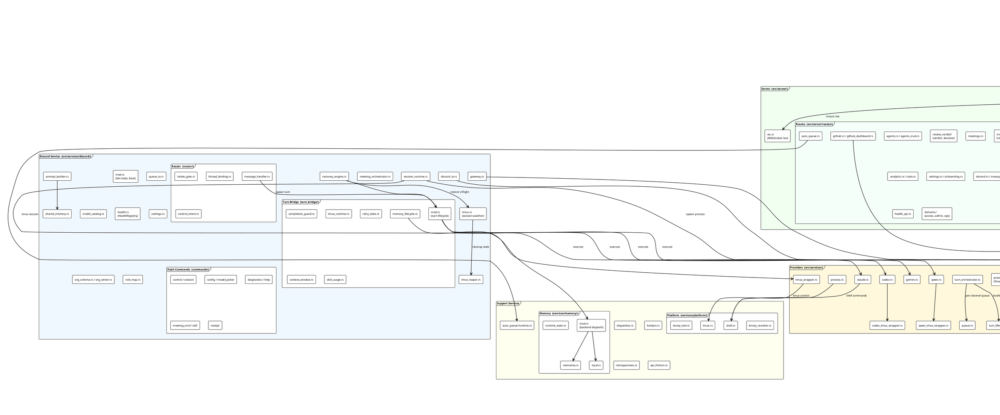

# AgentDesk Module Structure

```plantuml
@startuml AgentDesk Module Structure
!theme plain
skinparam componentStyle rectangle
skinparam packageStyle frame
skinparam arrowThickness 1.5
skinparam defaultFontSize 11
skinparam packageFontSize 13
skinparam componentFontSize 11

title AgentDesk — Full Module Structure

' ============================================================
' External Systems
' ============================================================
cloud "External Systems" {
    [Discord API] as DiscordAPI #LightSkyBlue
    [GitHub API\n(gh CLI)] as GitHubAPI #LightSkyBlue
    database "SQLite" as SQLiteDB #Wheat
}

' ============================================================
' Entry Point
' ============================================================
package "Entry Point" as EntryPkg #GhostWhite {
    [main.rs] as Main
    [bootstrap.rs] as Bootstrap
    [launch.rs] as Launch
    [config.rs] as Config
    [credential.rs] as Credential
}

' ============================================================
' CLI
' ============================================================
package "CLI  (src/cli/)" as CLIPkg #Lavender {
    [args.rs] as CliArgs
    [dcserver.rs] as DcServer
    [doctor.rs] as Doctor
    [init.rs] as Init
    [migrate/] as Migrate
    [discord.rs\n(send helpers)] as CliDiscord
    [client.rs\n(direct API)] as CliClient
}

' ============================================================
' Server (Axum HTTP)
' ============================================================
package "Server  (src/server/)" as ServerPkg #Honeydew {
    [mod.rs / boot.rs\n(Axum boot)] as ServerBoot
    [ws.rs\n(WebSocket /ws)] as WS
    [tick.rs\n(3-Tier Tick)] as Tick
    [worker_registry.rs] as Workers
    [background.rs] as Background

    package "Routes  (src/server/routes/)" as RoutesPkg #MintCream {
        [mod.rs\n(route registration)] as RouteMod
        [kanban.rs] as RKanban
        [agents.rs / agents_crud.rs] as RAgents
        [dispatches/\n(CRUD, outbox, delivery)] as RDispatches
        [review_verdict/\n(verdict, decision)] as RReview
        [auto_queue.rs] as RAutoQueue
        [pipeline.rs] as RPipeline
        [github.rs / github_dashboard.rs] as RGithub
        [meetings.rs] as RMeetings
        [analytics.rs / stats.rs] as RAnalytics
        [settings.rs / onboarding.rs] as RSettings
        [discord.rs / messages.rs] as RDiscord
        [health_api.rs] as RHealth
        [domains/\n(access, admin, ops)] as RDomains
    }
}

' ============================================================
' Policy Engine (QuickJS)
' ============================================================
package "Policy Engine  (src/engine/)" as EnginePkg #LavenderBlush {
    [mod.rs\n(QuickJS runtime)] as EngineCore
    [hooks.rs\n(10 lifecycle hooks)] as EngineHooks
    [loader.rs\n(hot-reload watcher)] as EngineLoader
    [transition.rs\n(state transitions)] as EngineTransition
    [intent.rs\n(deferred mutations)] as EngineIntent
    [sql_guard.rs] as SqlGuard

    package "Bridge Ops  (src/engine/ops/)" as OpsPkg #MistyRose {
        [db_ops] as OpsDb
        [kanban_ops] as OpsKanban
        [cards_ops] as OpsCards
        [dispatch_ops] as OpsDispatch
        [review_ops] as OpsReview
        [queue_ops] as OpsQueue
        [auto_queue_ops] as OpsAutoQueue
        [pipeline_ops] as OpsPipeline
        [message_ops] as OpsMessage
        [agent_ops] as OpsAgent
        [config_ops] as OpsConfig
        [kv_ops] as OpsKv
        [exec_ops] as OpsExec
        [http_ops] as OpsHttp
        [log_ops] as OpsLog
        [dm_reply_ops] as OpsDmReply
        [runtime_ops] as OpsRuntime
    }
}

' ============================================================
' JavaScript Policies
' ============================================================
package "JS Policies  (policies/)" as PoliciesPkg #LemonChiffon {
    [kanban-rules.js] as PKanban
    [review-automation.js] as PReview
    [auto-queue.js] as PAutoQueue
    [merge-automation.js] as PMerge
    [timeouts.js] as PTimeouts
    [deploy-pipeline.js] as PDeploy
    [ci-recovery.js] as PCiRecovery
    [triage-rules.js] as PTriage
    [pipeline.js] as PPipeline
}

' ============================================================
' Database Layer
' ============================================================
package "Database  (src/db/)" as DbPkg #OldLace {
    [mod.rs\n(Arc<Mutex<Connection>>)] as DbMod
    [schema.rs\n(migrations)] as DbSchema
    [kanban.rs] as DbKanban
    [agents.rs] as DbAgents
    [auto_queue.rs] as DbAutoQueue
    [session_transcripts.rs] as DbTranscripts
}

' ============================================================
' Kanban & Dispatch (top-level orchestration)
' ============================================================
package "Orchestration" as OrchPkg #AliceBlue {
    [kanban.rs\n(card orchestration)] as KanbanTop
    [dispatch/mod.rs\n(dispatch context)] as DispatchMod
    [pipeline.rs\n(stage resolution)] as PipelineTop
    [reconcile.rs\n(boot reconciliation)] as Reconcile
    [runtime.rs\n(SessionRuntime)] as RuntimeMod
    [supervisor/mod.rs] as Supervisor
}

' ============================================================
' Discord Service
' ============================================================
package "Discord Service  (src/services/discord/)" as DiscordPkg #AliceBlue {
    [mod.rs\n(bot state, boot)] as DiscordMod

    package "Router  (router/)" as RouterPkg {
        [message_handler.rs] as MsgHandler
        [intake_gate.rs] as IntakeGate
        [thread_binding.rs] as ThreadBind
        [control_intent.rs] as ControlIntent
    }

    package "Turn Bridge  (turn_bridge/)" as TurnPkg {
        [mod.rs\n(turn lifecycle)] as TurnMod
        [completion_guard.rs] as CompGuard
        [tmux_runtime.rs] as TmuxRT
        [retry_state.rs] as RetryState
        [memory_lifecycle.rs] as MemLife
        [context_window.rs] as CtxWindow
        [skill_usage.rs] as SkillUsage
    }

    package "Slash Commands  (commands/)" as CmdsPkg {
        [control / session] as CmdControl
        [config / model_picker] as CmdConfig
        [diagnostics / help] as CmdDiag
        [meeting_cmd / skill] as CmdMeeting
        [receipt] as CmdReceipt
    }

    [gateway.rs] as Gateway
    [discord_io.rs] as DiscordIO
    [queue_io.rs] as QueueIO
    [tmux.rs\n(session watcher)] as Tmux
    [tmux_reaper.rs] as TmuxReaper
    [recovery_engine.rs] as Recovery
    [session_runtime.rs] as SessRT
    [prompt_builder.rs] as PromptBuilder
    [shared_memory.rs] as SharedMem
    [meeting_orchestrator.rs] as MeetingOrch
    [model_catalog.rs] as ModelCat
    [health.rs\n(HealthRegistry)] as DiscHealth
    [settings.rs] as DiscSettings
    [org_schema.rs / org_writer.rs] as OrgSchema
    [role_map.rs] as RoleMap
}

' ============================================================
' Provider & Execution Services
' ============================================================
package "Providers  (src/services/)" as ProvidersPkg #Cornsilk {
    [claude.rs] as Claude
    [codex.rs] as Codex
    [gemini.rs] as Gemini
    [qwen.rs] as Qwen
    [provider.rs\n(ProviderKind)] as Provider
    [provider_exec.rs] as ProvExec
    [provider_runtime.rs] as ProvRT
    [session_backend.rs\n(ProcessBackend)] as SessBackend
    [tmux_wrapper.rs] as TmuxWrap
    [codex_tmux_wrapper.rs] as CodexTmuxWrap
    [qwen_tmux_wrapper.rs] as QwenTmuxWrap
    [process.rs] as Process
    [turn_orchestrator.rs] as TurnOrch
    [turn_lifecycle.rs] as TurnLife
    [queue.rs] as Queue
}

' ============================================================
' Support Services
' ============================================================
package "Support Services" as SupportPkg #Ivory {
    package "Memory  (services/memory/)" as MemPkg {
        [mod.rs\n(backend dispatch)] as MemMod
        [local.rs] as MemLocal
        [memento.rs] as MemMemento
        [runtime_state.rs] as MemRTState
    }

    package "Platform  (services/platform/)" as PlatPkg {
        [binary_resolver.rs] as BinRes
        [shell.rs] as Shell
        [tmux.rs] as PlatTmux
        [dump_tool.rs] as DumpTool
    }

    [auto_queue/runtime.rs] as AQRuntime
    [dispatches.rs] as SvcDispatches
    [kanban.rs] as SvcKanban
    [retrospectives.rs] as Retro
    [api_friction.rs] as ApiFriction
}

' ============================================================
' GitHub Integration
' ============================================================
package "GitHub  (src/github/)" as GithubPkg #Honeydew {
    [sync.rs\n(issue sync)] as GhSync
    [triage.rs\n(auto-triage)] as GhTriage
    [dod.rs\n(DoD mirroring)] as GhDod
}

' ============================================================
' Dashboard
' ============================================================
package "Dashboard  (dashboard/)" as DashPkg #Bisque {
    [React 19 + Vite + Tailwind] as DashApp
    [Pixi.js\n(office visualization)] as DashPixi
}

' ============================================================
' RELATIONSHIPS
' ============================================================

' --- Entry point flow ---
Main --> CliArgs : parse CLI
Main --> Bootstrap : initialize()
Bootstrap --> Config : load yaml
Bootstrap --> Credential : read tokens
Bootstrap --> DbMod : open DB
Bootstrap --> EngineCore : init QuickJS
Main --> Launch : run(state)
Launch --> ServerBoot : start Axum

' --- Server internals ---
ServerBoot --> RouteMod : mount /api
ServerBoot --> WS : mount /ws
ServerBoot --> Tick : spawn tick loops
ServerBoot --> Workers : register workers
ServerBoot --> Background : spawn tasks
ServerBoot --> DashApp : serve static\n/dashboard/dist/

' --- Tick -> Policy Engine ---
Tick --> EngineCore : fire_hook\n(OnTick30s/1min/5min)

' --- Policy Engine internals ---
EngineCore --> EngineHooks : dispatch hooks
EngineCore --> EngineLoader : watch & reload .js
EngineCore --> EngineTransition : state transitions
EngineCore --> EngineIntent : deferred mutations
EngineCore --> OpsPkg : register globals

' --- Engine <-> JS Policies (bidirectional) ---
EngineHooks -[#Blue,bold]-> PoliciesPkg : <b>fire hooks</b>\nonCardTransition\nonReviewVerdict\nonTick*\n...
PoliciesPkg -[#Red,bold]-> OpsPkg : <b>call bridge</b>\nagentdesk.kanban.*\nagentdesk.db.*\nagentdesk.dispatch.*\nagentdesk.review.*\nagentdesk.queue.*\n...

' --- Bridge Ops -> DB ---
OpsDb --> DbMod
OpsKanban --> DbMod
OpsCards --> DbMod
OpsDispatch --> DbMod
OpsReview --> DbMod
OpsKv --> DbMod

' --- DB -> SQLite ---
DbMod --> SQLiteDB : rusqlite

' --- Discord Service -> External ---
Gateway --> DiscordAPI : Serenity/Poise
DiscordIO --> DiscordAPI : send messages
MsgHandler --> TurnMod : spawn turn
TurnMod --> Claude : execute
TurnMod --> Codex : execute
TurnMod --> Gemini : execute
TurnMod --> Qwen : execute
SessRT --> SessBackend : spawn process
SessRT --> TmuxWrap : tmux session
Tmux --> TmuxReaper : cleanup stale

' --- Providers -> Platform ---
Claude --> Shell : shell commands
Codex --> CodexTmuxWrap
Qwen --> QwenTmuxWrap
TmuxWrap --> PlatTmux : tmux control
Process --> Shell

' --- Turn orchestration ---
TurnOrch --> Queue : per-channel queue
TurnOrch --> TurnLife : bookkeeping

' --- Kanban orchestration ---
KanbanTop --> EngineCore : fire OnCardTransition
KanbanTop --> DbKanban
DispatchMod --> DbMod
PipelineTop --> EngineCore

' --- GitHub ---
GhSync --> GitHubAPI : gh CLI
GhTriage --> GitHubAPI
GhDod --> GitHubAPI
GhSync --> DbMod

' --- Memory backends ---
PromptBuilder --> SharedMem
MemLife --> MemMod
MemMod --> MemLocal
MemMod --> MemMemento

' --- Recovery ---
Recovery --> Tmux : restore inflight
Recovery --> TurnMod

' --- Route handlers -> services ---
RKanban --> KanbanTop
RDispatches --> DispatchMod
RAutoQueue --> AQRuntime
RPipeline --> PipelineTop
RGithub --> GhSync

' --- Dashboard -> Server ---
DashApp -[#Gray]-> ServerBoot : HTTP API + /ws

' --- Legend ---
legend right
  |= Arrow |= Meaning |
  | <color:Blue><b>Blue</b></color> | Rust fires lifecycle hooks into JS policies |
  | <color:Red><b>Red</b></color> | JS policies call Rust bridge (agentdesk.*) |
  | Black | Rust module dependency |
  | <color:Gray>Gray</color> | Frontend to backend |
endlegend

@enduml
```
