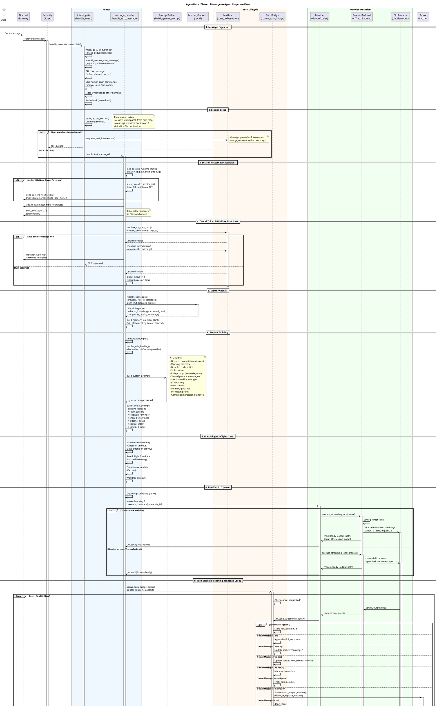

# Discord Message Flow — Sequence Diagram

```plantuml
@startuml
title AgentDesk: Discord Message to Agent Response Flow

skinparam sequenceArrowThickness 1.5
skinparam sequenceLifeLineBorderColor #555
skinparam participantPadding 12
skinparam boxPadding 8

actor User
participant "Discord\nGateway" as Discord
participant "Serenity\n(Poise)" as Serenity
box "Router" #F0F8FF
  participant "intake_gate\n(handle_event)" as IntakeGate
  participant "message_handler\n(handle_text_message)" as MsgHandler
end box
participant "PromptBuilder\n(build_system_prompt)" as Prompt
participant "MemoryBackend\n(recall)" as Memory
box "Turn Lifecycle" #FFF8F0
  participant "Mailbox\n(turn_orchestrator)" as Mailbox
  participant "TurnBridge\n(spawn_turn_bridge)" as TurnBridge
end box
box "Provider Execution" #F0FFF0
  participant "Provider\n(claude/codex)" as Provider
  participant "ProcessBackend\nor TmuxBackend" as Backend
  participant "CLI Process\n(claude/codex)" as CLI
end box
participant "Tmux\nWatcher" as TmuxWatcher

== 1. Message Ingestion ==

User -> Discord : Send message
Discord -> Serenity : FullEvent::Message
activate Serenity
Serenity -> IntakeGate : handle_event(ctx, event, data)
activate IntakeGate

IntakeGate -> IntakeGate : Message-ID dedup check\n(intake_dedup DashMap)
IntakeGate -> IntakeGate : should_process_turn_message()\n(Regular | InlineReply only)
IntakeGate -> IntakeGate : Skip bot messages\n(unless allowed_bot_ids)
IntakeGate -> IntakeGate : Skip human slash commands\n(known_slash_commands)
IntakeGate -> IntakeGate : Filter @mention to other humans
IntakeGate -> IntakeGate : Auth check (token hash)

== 2. Session Setup ==

IntakeGate -> IntakeGate : auto_restore_session()\n(from DB/settings)
note right
  If no session exists:
  - resolve_workspace() from role_map
  - create git worktree (for threads)
  - initialize DiscordSession
end note

alt Turn already active on channel
  IntakeGate -> Mailbox : enqueue_soft_intervention()
  note right
    Message queued as Intervention
    (merge_consecutive for user msgs)
  end note
  IntakeGate --> Serenity : Ok (queued)
else No active turn
  IntakeGate -> MsgHandler : handle_text_message()
  activate MsgHandler
end

== 3. Session Restore & Placeholder ==

MsgHandler -> MsgHandler : load_session_runtime_state()\n(session_id, path, memento flag)

alt session_id is None && not force_new
  MsgHandler -> MsgHandler : fetch_provider_session_id()\n(from DB via internal API)
  MsgHandler -> Discord : send_restore_notification()\n("Session restored: claude (abc12345)")
end

MsgHandler -> Discord : add_reaction(user_msg, hourglass)
MsgHandler -> Discord : send_message("...")\n(placeholder)
note right : Placeholder appears\nin Discord channel

== 4. Cancel Token & Mailbox Turn Start ==

MsgHandler -> Mailbox : mailbox_try_start_turn()\n(cancel_token, owner, msg_id)
activate Mailbox

alt Race: another message won
  Mailbox --> MsgHandler : started = false
  MsgHandler -> Mailbox : enqueue_intervention()\n(re-queue this message)
  MsgHandler -> Discord : delete placeholder\n+ remove hourglass
  MsgHandler --> IntakeGate : Ok (re-queued)
else Turn acquired
  Mailbox --> MsgHandler : started = true
  MsgHandler -> MsgHandler : global_active += 1\nrecord turn_start_time
end
deactivate Mailbox

== 5. Memory Recall ==

MsgHandler -> Memory : recall(RecallRequest)\n{provider, role_id, session_id,\n user_text, dispatch_profile}
activate Memory
Memory --> MsgHandler : RecallResponse\n{shared_knowledge, external_recall,\n longterm_catalog, warnings}
deactivate Memory

MsgHandler -> MsgHandler : build_memory_injection_plan()\n(SAK placement: system vs context)

== 6. Prompt Building ==

MsgHandler -> MsgHandler : sanitize_user_input()
MsgHandler -> MsgHandler : resolve_role_binding()\n(channel -> role/model/provider)

MsgHandler -> Prompt : build_system_prompt()
activate Prompt
note right
  Assembles:
  - Discord context (channel, user)
  - Working directory
  - Disabled tools notice
  - Skills notice
  - Role prompt (from role_map)
  - Shared prompt (cross-agent)
  - SAK (shared knowledge)
  - LTM catalog
  - Date context
  - Memory guidance
  - Formatting rules
  - Context compression guidance
end note
Prompt --> MsgHandler : system_prompt_owned
deactivate Prompt

MsgHandler -> MsgHandler : Build context_prompt:\n  pending_uploads\n  + reply_context\n  + followup_reminder\n  + shared_knowledge\n  + external_recall\n  + control_intent\n  + sanitized_input

== 7. Watchdog & Inflight State ==

MsgHandler -> MsgHandler : Spawn turn watchdog\n(cancel on timeout,\n auto-extend on activity)
MsgHandler -> MsgHandler : Save InflightTurnState\n(for crash recovery)
MsgHandler -> MsgHandler : Pause tmux watcher\n(if exists)
MsgHandler -> MsgHandler : Worktree autosync

== 8. Provider CLI Spawn ==

MsgHandler -> MsgHandler : Create mpsc channel (tx, rx)
MsgHandler -> Provider : spawn_blocking {\n  execute_command_streaming() }
activate Provider

alt Claude + tmux available
  Provider -> Backend : execute_streaming_local_tmux()
  activate Backend
  Backend -> Backend : Write prompt to file
  Backend -> CLI : tmux new-session / send-keys\n(claude -p --stream-json ...)
  activate CLI
  Backend -> Provider : TmuxReady {output_path,\n input_fifo, session_name}
  Provider -> MsgHandler : tx.send(TmuxReady)
else Claude + no tmux (ProcessBackend)
  Provider -> Backend : execute_streaming_local_process()
  activate Backend
  Backend -> CLI : spawn child process\n(agentdesk --tmux-wrapper ...)
  activate CLI
  Backend -> Provider : ProcessReady {output_path}
  Provider -> MsgHandler : tx.send(ProcessReady)
end

== 9. Turn Bridge (Streaming Response Loop) ==

MsgHandler -> TurnBridge : spawn_turn_bridge(shared,\n cancel_token, rx, context)
activate TurnBridge

loop Every ~1s while !done
  TurnBridge -> TurnBridge : Check cancel_requested()

  CLI -> Backend : JSONL output lines
  Backend -> Provider : parse stream events
  Provider -> TurnBridge : tx.send(StreamMessage::*)

  alt StreamMessage::Init
    TurnBridge -> TurnBridge : Store new_session_id
  else StreamMessage::Text
    TurnBridge -> TurnBridge : Append to full_response
  else StreamMessage::Thinking
    TurnBridge -> TurnBridge : Update status: "Thinking..."
  else StreamMessage::ToolUse
    TurnBridge -> TurnBridge : Update status: "tool_name: summary"
  else StreamMessage::ToolResult
    TurnBridge -> TurnBridge : Mark tool complete
  else StreamMessage::StatusUpdate
    TurnBridge -> TurnBridge : Track token counts
  else StreamMessage::TmuxReady
    TurnBridge -> TmuxWatcher : Spawn tmux_output_watcher()\n(claim_or_replace_watcher)
    activate TmuxWatcher
  else StreamMessage::Done
    TurnBridge -> TurnBridge : done = true
  else StreamMessage::Error
    TurnBridge -> TurnBridge : Handle error\n(prompt_too_long, stale_resume, etc.)
    TurnBridge -> TurnBridge : done = true
  end

  == 10. Placeholder Update ==

  TurnBridge -> TurnBridge : Build status block:\n  spinner + prev_tool_status\n  + current_tool_line
  TurnBridge -> Discord : gateway.edit_message()\n(response tail + status footer)
  TurnBridge -> TurnBridge : Save inflight_state\n(crash recovery)
  TurnBridge -> TurnBridge : ADK heartbeat (every 30s)
end

deactivate CLI
deactivate Backend
deactivate Provider

== 11. Turn Completion ==

TurnBridge -> TurnBridge : Extract API friction reports
TurnBridge -> TurnBridge : Guard review dispatch completion

alt Dispatch turn (impl/rework)
  TurnBridge -> TurnBridge : complete_work_dispatch_on_turn_end()
end

TurnBridge -> TurnBridge : Post session status = "idle"

TurnBridge -> Mailbox : mailbox_finish_turn()\n(remove cancel_token,\n check pending queue)
activate Mailbox
Mailbox --> TurnBridge : FinishTurnResult\n{removed_token, has_pending}
deactivate Mailbox

TurnBridge -> TurnBridge : global_active -= 1
TurnBridge -> Discord : remove_reaction(hourglass)

alt Cancelled
  TurnBridge -> Discord : replace_message("[Stopped]")
  TurnBridge -> Discord : add_reaction(stop_sign)
else Prompt too long
  TurnBridge -> Discord : replace_message(warning)
else Tmux handoff (empty response)
  TurnBridge -> Discord : edit_message("Processing...")
  note right : TmuxWatcher will\ndeliver final response
else Normal completion
  TurnBridge -> TurnBridge : format_for_discord_with_provider()
  TurnBridge -> Discord : replace_message(formatted_response)
  TurnBridge -> Discord : add_reaction(checkmark)
end

== 12. Post-Turn Cleanup ==

TurnBridge -> TurnBridge : Resume tmux watcher\n(if applicable)
TurnBridge -> TurnBridge : Update session state\n(session_id, history)
TurnBridge -> TurnBridge : Persist session transcript (DB)
TurnBridge -> TurnBridge : Persist provider session_id (DB)
TurnBridge -> Memory : Memory capture/reflect\n(background task)
TurnBridge -> TurnBridge : Record turn metrics
TurnBridge -> TurnBridge : Clear inflight_state

== 13. Intervention Queue Processing ==

alt has_queued_turns && !restart_pending
  TurnBridge -> Mailbox : mailbox_take_next_soft_intervention()
  activate Mailbox
  Mailbox --> TurnBridge : (intervention, has_more)
  deactivate Mailbox
  TurnBridge -> TurnBridge : gateway.dispatch_queued_turn()
  note right
    Calls handle_text_message()
    for the queued intervention,
    starting the cycle again at step 3
  end note
else restart_pending
  TurnBridge -> TurnBridge : Skip dequeue\n(queues saved to disk)
end

deactivate TurnBridge
deactivate MsgHandler
deactivate IntakeGate
deactivate Serenity
deactivate TmuxWatcher

@enduml
```
