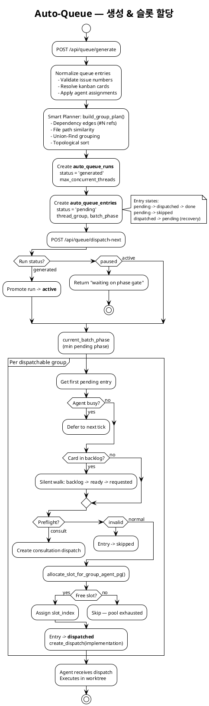

# Auto-Queue: 생성 + 활성화 + 슬롯 할당

```plantuml
@startuml auto-queue-creation
!theme plain
skinparam ActivityFontSize 11
skinparam NoteFontSize 10
skinparam PartitionFontSize 12

title Auto-Queue — 생성 & 슬롯 할당

|#LightBlue|Rust (API / DB)|

start
:POST /api/queue/generate;

:Normalize queue entries
  - Validate issue numbers
  - Resolve kanban cards
  - Apply agent assignments;

:Smart Planner: build_group_plan()
  - Dependency edges (#N refs)
  - File path similarity
  - Union-Find grouping
  - Topological sort;

:Create **auto_queue_runs**
  status = 'generated'
  max_concurrent_threads;

:Create **auto_queue_entries**
  status = 'pending'
  thread_group, batch_phase;

note right
  Entry states:
  pending -> dispatched -> done
  pending -> skipped
  dispatched -> pending (recovery)
end note

:POST /api/queue/dispatch-next;

if (Run status?) then (generated)
  :Promote run -> **active**;
elseif (paused) then
  :Return "waiting on phase gate";
  stop
else (active)
endif

:current_batch_phase
(min pending phase);

partition "Per dispatchable group" {
  :Get first pending entry;

  if (Agent busy?) then (yes)
    :Defer to next tick;
    detach
  else (no)
  endif

  if (Card in backlog?) then (yes)
    :Silent walk: backlog -> ready -> requested;
  else (no)
  endif

  if (Preflight?) then (consult)
    :Create consultation dispatch;
    detach
  elseif (invalid) then
    :Entry -> skipped;
    detach
  else (normal)
  endif

  :allocate_slot_for_group_agent_pg();

  if (Free slot?) then (yes)
    :Assign slot_index;
  else (no)
    :Skip — pool exhausted;
    detach
  endif

  :Entry -> **dispatched**
  create_dispatch(implementation);
}

:Agent receives dispatch
Executes in worktree;
stop

@enduml
```
