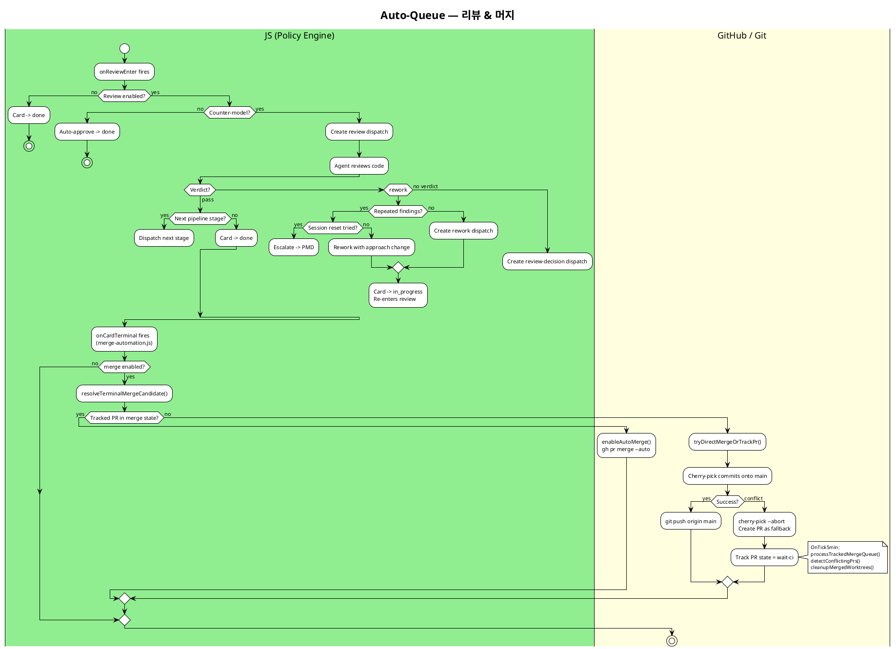

# Auto-Queue: 리뷰 사이클 + 머지

```plantuml
@startuml auto-queue-review-merge
!theme plain
skinparam ActivityFontSize 11
skinparam NoteFontSize 10

title Auto-Queue — 리뷰 & 머지

|#LightGreen|JS (Policy Engine)|
|#LightYellow|GitHub / Git|

|JS (Policy Engine)|
start
:onReviewEnter fires;

if (Review enabled?) then (no)
  :Card -> done;
  stop
else (yes)
  if (Counter-model?) then (no)
    :Auto-approve -> done;
    stop
  else (yes)
    :Create review dispatch;
    :Agent reviews code;

    if (Verdict?) then (pass)
      if (Next pipeline stage?) then (yes)
        :Dispatch next stage;
        detach
      else (no)
        :Card -> done;
      endif
    elseif (rework) then
      if (Repeated findings?) then (yes)
        if (Session reset tried?) then (yes)
          :Escalate -> PMD;
          detach
        else (no)
          :Rework with approach change;
        endif
      else (no)
        :Create rework dispatch;
      endif
      :Card -> in_progress
      Re-enters review;
      detach
    else (no verdict)
      :Create review-decision dispatch;
      detach
    endif
  endif
endif

|JS (Policy Engine)|
:onCardTerminal fires
(merge-automation.js);

if (merge enabled?) then (yes)
  :resolveTerminalMergeCandidate();

  if (Tracked PR in merge state?) then (yes)
    |GitHub / Git|
    :enableAutoMerge()
    gh pr merge --auto;
  else (no)
    :tryDirectMergeOrTrackPr();

    |GitHub / Git|
    :Cherry-pick commits onto main;

    if (Success?) then (yes)
      :git push origin main;
    else (conflict)
      :cherry-pick --abort
      Create PR as fallback;
      :Track PR state = wait-ci;

      note right
        OnTick5min:
        processTrackedMergeQueue()
        detectConflictingPrs()
        cleanupMergedWorktrees()
      end note
    endif
  endif
else (no)
endif

stop

@enduml
```
