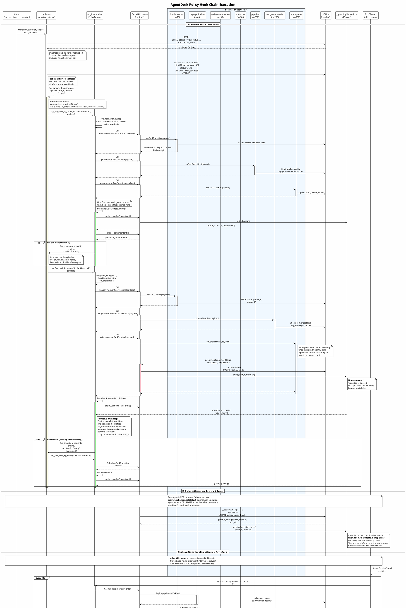

# Policy Hook Chain Execution

```plantuml
@startuml hook-chain-execution
!theme plain
skinparam backgroundColor #FEFEFE
skinparam sequenceMessageAlign center
skinparam maxMessageSize 200
skinparam responseMessageBelowArrow true

title AgentDesk Policy Hook Chain Execution

' ============================================================
'  Participants
' ============================================================

participant "Caller\n(route / dispatch / session)" as Caller
participant "kanban.rs\ntransition_status()" as Kanban
participant "engine/mod.rs\nPolicyEngine" as Engine
participant "QuickJS Runtime\n(rquickjs)" as JS

box "Policies (priority order)" #F0F8FF
  participant "kanban-rules\n(p=10)" as P10
  participant "deploy-pipeline\n(p=45)" as P45
  participant "review-automation\n(p=50)" as P50
  participant "timeouts\n(p=100)" as P100
  participant "pipeline\n(p=200)" as P200
  participant "merge-automation\n(p=200)" as P200m
  participant "auto-queue\n(p=500)" as P500
end box

participant "SQLite\n(rusqlite)" as DB
participant "__pendingTransitions\n(JS array)" as PendQ
participant "Tick Thread\n(tokio::spawn)" as Tick

' ============================================================
'  1. OnCardTerminal — Full Chain (card transitions to "done")
' ============================================================

== OnCardTerminal: Full Hook Chain ==

Caller -> Kanban : transition_status(db, engine,\ncard_id, "done")
activate Kanban

Kanban -> DB : BEGIN\nSELECT status, review_status, ...\nfrom kanban_cards
DB --> Kanban : old_status="review"

note right of Kanban
  **transition::decide_status_transition()**
  Pure function: evaluates gates,
  produces TransitionIntent list
end note

Kanban -> DB : Execute intents atomically:\n  UPDATE kanban_cards SET status='done'\n  INSERT kanban_audit_log\nCOMMIT

note right of Kanban
  **Post-transition side-effects**
  sync_terminal_card_state()
  github_sync_on_transition()
end note

Kanban -> Kanban : fire_dynamic_hooks(engine,\npipeline, card_id, "review", "done")
activate Kanban #LightYellow

note right of Kanban
  Pipeline YAML lookup:
  hooks.review.on_exit = [] (none)
  hooks.done.on_enter = [OnCardTransition, OnCardTerminal]
end note

' ---- OnCardTransition fires first (from done.on_enter) ----
Kanban -> Engine : try_fire_hook_by_name("OnCardTransition", payload)
activate Engine

Engine -> Engine : fire_hook_with_guard()\nCollect handlers from all policies\nsorted by priority

Engine -> JS : Call kanban-rules.onCardTransition(payload)
activate JS
JS -> P10 : onCardTransition(payload)
activate P10
P10 -> DB : Read dispatch info, card state
P10 --> JS : (side-effects: dispatch creation, PMD notify)
deactivate P10
JS --> Engine
deactivate JS

Engine -> JS : Call pipeline.onCardTransition(payload)
activate JS
JS -> P200 : onCardTransition(payload)
activate P200
P200 -> DB : Read pipeline config,\ntrigger on-enter dispatches
P200 --> JS
deactivate P200
JS --> Engine
deactivate JS

Engine -> JS : Call auto-queue.onCardTransition(payload)
activate JS
JS -> P500 : onCardTransition(payload)
activate P500
P500 -> DB : Update auto_queue_entries
P500 --> JS
deactivate P500
JS --> Engine
deactivate JS

note right of Engine
  After fire_hook_with_guard returns,
  flush_hook_side_effects_inline() runs
end note

Engine -> Engine : flush_hook_side_effects_inline()
activate Engine #LightGreen

Engine -> JS : drain __pendingTransitions[]
JS -> PendQ : splice & return
PendQ --> Engine : [(card_x, "ready", "requested"), ...]

Engine -> JS : drain __pendingIntents[]
JS --> Engine : [dispatch_create intents, ...]

loop For each drained transition
  Engine -> Kanban : fire_transition_hooks(db, engine,\ncard_id, from, to)
  note right of Kanban
    Recursive: resolves pipeline,
    fires on_exit/on_enter hooks,
    then drain_hook_side_effects again
  end note
end

deactivate Engine
deactivate Engine

' ---- OnCardTerminal fires second (from done.on_enter) ----
Kanban -> Engine : try_fire_hook_by_name("OnCardTerminal", payload)
activate Engine

Engine -> Engine : fire_hook_with_guard()\nIterate policies with onCardTerminal

Engine -> JS : Call kanban-rules.onCardTerminal(payload)
activate JS
JS -> P10 : onCardTerminal(payload)
activate P10
P10 -> DB : UPDATE completed_at,\nrecord XP
P10 --> JS
deactivate P10
JS --> Engine
deactivate JS

Engine -> JS : Call merge-automation.onCardTerminal(payload)
activate JS
JS -> P200m : onCardTerminal(payload)
activate P200m
P200m -> DB : Check PR merge status,\ntrigger merge if ready
P200m --> JS
deactivate P200m
JS --> Engine
deactivate JS

Engine -> JS : Call auto-queue.onCardTerminal(payload)
activate JS
JS -> P500 : onCardTerminal(payload)
activate P500

note right of P500
  auto-queue advances to next entry:
  finds next pending entry, calls
  agentdesk.kanban.setStatus() to
  transition the next card
end note

P500 -> JS : agentdesk.kanban.setStatus(\nnextCardId, "requested")
activate JS #Pink

JS -> DB : __setStatusRaw()\nUPDATE kanban_cards

JS -> PendQ : push({card_id, from, to})
note right of PendQ
  **Non-reentrant!**
  Transition is queued,
  NOT processed immediately.
  Engine lock is held.
end note

JS --> P500
deactivate JS
P500 --> JS
deactivate P500
JS --> Engine
deactivate JS

Engine -> Engine : flush_hook_side_effects_inline()
activate Engine #LightGreen

Engine -> JS : drain __pendingTransitions[]
PendQ --> Engine : [(nextCardId, "ready", "requested")]

note right of Engine
  **Recursive drain loop:**
  For the cascaded transition,
  fire_transition_hooks fires
  on_enter hooks for "requested"
  state, which may produce more
  pending transitions.
  Loop continues until queue empty.
end note

loop Cascade until __pendingTransitions empty
  Engine -> Kanban : fire_transition_hooks(db, engine,\nnextCardId, "ready", "requested")
  Kanban -> Engine : try_fire_hook_by_name("OnCardTransition", ...)
  Engine -> JS : Call all onCardTransition handlers
  JS --> Engine
  Engine -> Engine : flush side effects
  Engine -> JS : drain __pendingTransitions[]
  PendQ --> Engine : [] (empty = stop)
end

deactivate Engine
deactivate Engine

deactivate Kanban
deactivate Kanban

' ============================================================
'  2. JS Bridge: setStatus queues into __pendingTransitions
' ============================================================

== JS Bridge: setStatus Non-Reentrant Queue ==

note across
  The engine is NOT reentrant. When a policy calls
  **agentdesk.kanban.setStatus()** during hook execution,
  it performs the DB UPDATE immediately but queues the
  transition for post-hook processing.
end note

JS -> DB : __setStatusRaw(cardId, newStatus)\nUPDATE kanban_cards directly
DB --> JS : {ok:true, changed:true, from, to, card_id}

JS -> PendQ : __pendingTransitions.push(\n  {card_id, from, to})

note right of PendQ
  After the current hook handler returns,
  **flush_hook_side_effects_inline()** drains
  this array and fires follow-up hooks.
  This prevents infinite recursion and ensures
  hooks execute in a well-defined order.
end note

' ============================================================
'  3. Tick Loop (separate tokio task)
' ============================================================

== Tick Loop: Tiered Hook Firing (Separate Async Task) ==

note across
  **policy_tick_loop** runs as a background tokio task.
  It fires tiered hooks at different intervals to prevent
  slow sections from blocking time-critical recovery.
end note

Tick -> Tick : interval_30s.tick().await\ncount++

group Every 30s
  Tick -> Engine : try_fire_hook_by_name("OnTick30s", {})
  activate Engine
  Engine -> JS : Call handlers in priority order
  JS -> P45 : deploy-pipeline.onTick30s()
  activate P45
  P45 -> DB : Poll deploy queue,\nstart/monitor deploys
  P45 --> JS
  deactivate P45
  JS -> P100 : timeouts.onTick30s()
  activate P100
  P100 -> DB : Retry stale dispatches,\nnotification recovery,\ndeadlock detection [I],\norphan recovery [K]
  P100 --> JS
  deactivate P100
  JS --> Engine
  deactivate Engine
  Tick -> Kanban : drain_hook_side_effects(db, engine)
end

group Every 60s (count % 2 == 0)
  Tick -> Engine : try_fire_hook_by_name("OnTick1min", {})
  activate Engine
  Engine -> JS : Call handlers in priority order
  JS -> P100 : timeouts.onTick1min()
  activate P100
  P100 -> DB : Non-critical timeouts\n[A][C][D][E][L],\nstale detection
  P100 --> JS
  deactivate P100
  JS -> P500 : auto-queue.onTick1min()
  activate P500
  P500 -> DB : Skip terminal entries,\nreset stuck dispatched,\nauto-dispatch next
  P500 --> JS
  deactivate P500
  JS --> Engine
  deactivate Engine
  Tick -> Kanban : drain_hook_side_effects(db, engine)
end

group Every 300s (count % 10 == 0)
  Tick -> Engine : try_fire_hook_by_name("OnTick5min", {})
  activate Engine
  Engine -> JS : Call handlers in priority order
  JS -> P100 : timeouts.onTick5min()
  activate P100
  P100 -> DB : Non-critical reconciliation\n[R][B][F][G][H][M][O],\nidle session cleanup
  P100 --> JS
  deactivate P100
  JS -> P200m : merge-automation.onTick5min()
  activate P200m
  P200m -> DB : Poll PR merge status
  P200m --> JS
  deactivate P200m
  JS --> Engine
  deactivate Engine
  Tick -> Kanban : drain_hook_side_effects(db, engine)

  note right of Tick
    Also fires legacy **OnTick** (5min)
    for backward compatibility:
    triage-rules.onTick (p=300),
    timeouts.onTick (p=100)
  end note

  Tick -> Engine : try_fire_hook_by_name("OnTick", {})
  activate Engine
  Engine -> JS : Call triage-rules.onTick(),\ntimeouts.onTick()
  JS --> Engine
  deactivate Engine
  Tick -> Kanban : drain_hook_side_effects(db, engine)
end

' ============================================================
'  4. Event Hooks (non-state-transition-bound)
' ============================================================

== Event Hooks: OnDispatchCompleted, OnReviewVerdict, OnSessionStatusChange ==

note across
  Event hooks fire on lifecycle events regardless of card state.
  Pipeline YAML events section maps event names to hook names.
  Policies register handlers on these hook names.
end note

Caller -> Kanban : fire_event_hooks(db, engine,\n"on_dispatch_completed",\n"OnDispatchCompleted", payload)
activate Kanban

Kanban -> Engine : try_fire_hook_by_name("OnDispatchCompleted", payload)
activate Engine
Engine -> JS : Call handlers in priority order

JS -> P10 : kanban-rules.onDispatchCompleted()
activate P10
note right of P10
  PM Decision Gate:
  checks verdict, creates
  review dispatch or transitions
  card to done
end note
P10 --> JS
deactivate P10

JS -> P45 : deploy-pipeline.onDispatchCompleted()
activate P45
P45 --> JS
deactivate P45

JS -> P50 : review-automation.onDispatchCompleted()
activate P50
note right of P50
  Processes review/decision
  dispatch results, fires
  verdict handling
end note
P50 --> JS
deactivate P50

JS -> P200 : pipeline.onDispatchCompleted()
activate P200
P200 --> JS
deactivate P200

JS -> P500 : auto-queue.onDispatchCompleted()
activate P500
P500 --> JS
deactivate P500

JS --> Engine
deactivate Engine

Kanban -> Engine : drain_pending_intents()
Kanban -> Kanban : drain_hook_side_effects(db, engine)

deactivate Kanban

' ============================================================
'  5. Error Propagation
' ============================================================

== Error Propagation: One Policy Failure ==

note across
  When a policy throws an error during hook execution,
  the error is **logged but does not stop** subsequent policies.
  Each policy runs independently in priority order.
end note

Engine -> JS : Call kanban-rules.onCardTerminal(payload)
activate JS
JS -> P10 : onCardTerminal(payload)
activate P10
P10 --> JS : **throws Error("DB lock")**
deactivate P10
JS --> Engine : JsResult::Err
deactivate JS

note right of Engine #FFCCCC
  **tracing::error!**
  policy_name="kanban-rules"
  hook="onCardTerminal"
  error="DB lock\n  at onCardTerminal (kanban-rules.js:659)"

  Error is caught. Execution **continues**
  to the next policy.
end note

Engine -> JS : Call merge-automation.onCardTerminal(payload)
activate JS
JS -> P200m : onCardTerminal(payload)
activate P200m
P200m --> JS : OK (runs normally)
deactivate P200m
JS --> Engine
deactivate JS

Engine -> JS : Call auto-queue.onCardTerminal(payload)
activate JS
JS -> P500 : onCardTerminal(payload)
activate P500
P500 --> JS : OK (runs normally)
deactivate P500
JS --> Engine
deactivate JS

note right of Engine
  All policies executed.
  flush_hook_side_effects_inline()
  runs normally even after errors.
  Side effects from successful
  policies are still processed.
end note

' ============================================================
'  Legend
' ============================================================

legend bottom
  |= Symbol |= Meaning |
  | p=N | Policy priority (lower = runs first) |
  | __pendingTransitions | JS array accumulating deferred status changes |
  | __pendingIntents | JS array accumulating deferred dispatch intents |
  | flush_hook_side_effects | Drain loop: process queued transitions recursively |
  | fire_dynamic_hooks | Reads pipeline YAML on_enter/on_exit hook bindings |
  | fire_hook_with_guard | Iterates policies in priority order, calls JS handlers |

  **Policy Registration (priority order):**
  pr-tracking (1) | kanban-rules (10) | deploy-pipeline (45)
  ci-recovery (46) | review-automation (50) | timeouts (100)
  pipeline (200) | merge-automation (200) | triage-rules (300) | auto-queue (500)
end legend

@enduml
```
